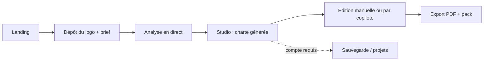

# 01 — Produit : périmètre MVP et critères d'acceptation

> Statut : **validé** — Version 4.0 — 2026-10-07
> Remplace : `CAHIER_DES_CHARGES.md` §3 et `ACCEPTANCE_CRITERIA.md` §2.
> Tous les critères sont **vérifiables par un test** ou une mesure. Un critère non testable est une erreur de spécification : à signaler.

## 1. Parcours cible

Un visiteur **sans compte** peut aller jusqu'à l'aperçu et l'édition (session invitée). L'export complet et la sauvegarde durable demandent un compte.

## 2. Priorités (MoSCoW)

| Priorité | Fonctionnalités |
|---|---|
| **Must** | US-01 à US-12, US-13 |
| **Should** | US-14 lien de partage en lecture seule |
| **Could** | Thème clair de l'interface, import de brief PDF/DOCX |
| **Won't (MVP)** | Voir `00_CHARTER.md` §6 |

## 3. Limites techniques d'entrée

| Élément | Limite | Raison |
|---|---|---|
| Logo SVG | 5 Mo, 50 000 nœuds, profondeur 64 | Protection mémoire et CPU |
| Logo raster (PNG, WebP, JPEG) | 10 Mo, 8192 × 8192 px | Protection contre les bombes de décompression |
| Brief texte | 8 000 caractères | Coût IA |
| Brief document (PDF, DOCX) — *Could* | 15 Mo, 40 pages | Coût et surface d'attaque |
| Projets par compte gratuit | 3 | Coût |
| Sessions invitées | 1 projet, conservé 24 h | RGPD, coût |

## 4. Contenu de la charte (pages générées)

| # | Page | Contenu |
|---|---|---|
| 1 | Couverture | Logo, nom de marque, date |
| 2 | Manifeste | Mission, vision, 4 valeurs, archétype |
| 3 | Logo | Version principale et variantes (couleur, noir, blanc, favicon) |
| 4 | Zone d'exclusion | Clear space (X) et taille minimale |
| 5 | Do & Don't | 4 règles illustrées |
| 6 | Palette | Couleurs, formats, échelles de teintes |
| 7 | Contrastes | Matrice complète des combinaisons texte/fond |
| 8 | Typographie | Couple de polices, hiérarchie |
| 9 | Ton de voix | 4 axes + exemples |
| 10 à 12 | Mockups | Jusqu'à 3 scènes planes |
| Annexe | Tokens | `design-tokens.json` aperçu |

## 5. User stories et critères d'acceptation

### US-01 — Essayer sans compte
*En tant que visiteur, je veux tester le produit sans m'inscrire.*
- **AC-01.1** Un visiteur peut lancer une analyse sans compte ; une session invitée signée (cookie `HttpOnly`) est créée.
- **AC-01.2** Un projet invité est supprimé définitivement au bout de 24 h (job vérifié par test).
- **AC-01.3** À l'inscription, le projet invité peut être rattaché au compte sans perte de données.
- **AC-01.4** Un logo d'exemple fourni par le produit peut être chargé en un clic.

### US-02 — Déposer un logo
- **AC-02.1** Glisser-déposer ou sélection de fichier pour SVG, PNG, WebP, JPEG.
- **AC-02.2** Le type est déterminé par les **octets** du fichier, jamais par l'extension ni l'en-tête.
- **AC-02.3** Un fichier invalide, trop lourd ou dangereux est refusé avec un message explicite, bienveillant et actionnable (ex. « Ce SVG contient des polices non converties en tracés : exporte-le avec les textes en contours »).
- **AC-02.4** Un SVG est assaini (allowlist, `05_ENGINES.md` §3) ; l'aperçu est identique au tracé original pour un SVG légitime (tests de non-régression visuelle sur 10 logos).
- **AC-02.5** Un SVG contenant un script, un gestionnaire d'événement, une référence externe, un `DOCTYPE` ou une entité est refusé ou nettoyé selon le corpus d'attaque (`10_QUALITY.md` §6).
- **AC-02.6** L'original n'est jamais servi au navigateur ; seul l'asset assaini l'est, via une balise ``.

### US-03 — Décrire l'univers
- **AC-03.1** Champ de texte libre (≤ 8 000 caractères), langue détectée ou choisie (français, anglais).
- **AC-03.2** Suggestions d'univers proposées pendant la saisie (liste statique d'au moins 30 exemples, pas d'appel IA).
- **AC-03.3** (*Could*) Import d'un brief PDF/DOCX : texte extrait dans un worker isolé avec délai maximal de 20 s.

### US-04 — Suivre l'analyse
- **AC-04.1** Une timeline de 4 étapes s'affiche et se met à jour en temps réel (SSE).
- **AC-04.2** Une zone `aria-live="polite"` annonce chaque étape.
- **AC-04.3** En cas d'échec d'une étape, un message précis et une action de reprise sont proposés ; aucune perte du logo ni du brief.
- **AC-04.4** L'analyse complète (hors mockups) se termine en moins de 30 s au 90e centile sur le jeu de test.

### US-05 — Palette accessible
- **AC-05.1** La palette contient au minimum : une couleur dominante, une couleur d'accent, un neutre clair, un neutre sombre.
- **AC-05.2** Les cas dégénérés (logo monochrome, bichrome) produisent une palette complétée, marquée `dérivée`, jamais une erreur.
- **AC-05.3** Chaque couleur est affichée en HEX, RVB, HSL, OKLCH et CMJN indicatif (§CMJN de `05_ENGINES.md`).
- **AC-05.4** Les ratios de contraste sont calculés selon WCAG 2.2 et comparés sur la valeur non arrondie. Les niveaux affichés : Échec (< 3), Grand texte / composants (≥ 3), AA (≥ 4,5), AAA (≥ 7). Chaque niveau combine icône, texte et couleur.
- **AC-05.5** Une matrice de contraste n × n de toute la palette est affichée et exportée.
- **AC-05.6** Les valeurs de référence de `docs/golden/color.golden.json` sont reproduites dans les tolérances indiquées.

### US-06 — Variantes de logo
- **AC-06.1** Variantes générées : couleur (original assaini), monochrome noir `#000000`, monochrome blanc `#FFFFFF`, favicon carré (marge de sécurité 10 % de chaque côté).
- **AC-06.2** Pour un SVG simple (sans masque, filtre ni image intégrée), les variantes sont **vectorielles**.
- **AC-06.3** Pour un SVG complexe ou un raster, la variante est produite par la chaîne de vectorisation et un **score de fidélité** (IoU du masque ≥ 0,97) est calculé ; en dessous, un avertissement clair est affiché et la variante est marquée « à vérifier ».
- **AC-06.4** Aucune variante n'est silencieusement dégradée : tout échec est signalé avec la cause.
- **AC-06.5** Export favicon : SVG, PNG 16, 32, 48, 180, 192, 512.

### US-07 — Clear space et règles d'usage
- **AC-07.1** Zone d'exclusion : X = 25 % de la hauteur de la boîte englobante du logo par défaut, ajustable de 10 % à 50 %. Le calcul est affiché sur un schéma.
- **AC-07.2** Taille minimale recommandée : valeurs par défaut modifiables, présentées comme des **recommandations**, non comme des normes.
- **AC-07.3** Quatre règles Do & Don't illustrées avec le logo réel : pas de déformation, pas de rotation, pas de changement de couleur, pas de fond qui nuit à la lisibilité.

### US-08 — Typographie
- **AC-08.1** Le couple de polices est choisi **dans le catalogue fermé** de `09_DESIGN_SYSTEM.md` §8.
- **AC-08.2** Aperçu en temps réel au changement de couple ; hiérarchie (titre, sous-titre, corps, légende) affichée.
- **AC-08.3** Les polices sont auto-hébergées (aucun appel à un CDN tiers).

### US-09 — Mockups
- **AC-09.1** Trois scènes planes au MVP (carte de visite, écran, affiche/cadre). La scène est choisie dans le catalogue selon l'univers ; repli générique si aucun ne correspond.
- **AC-09.2** Le logo est appliqué avec correction de perspective, sans flou visible à 100 % de zoom sur le rendu 3840 × 2160.
- **AC-09.3** Finitions disponibles : impression plate, embossage, dorure. Chacune est cohérente avec la lumière de la scène (`06_MOCKUP_ENGINE.md`).
- **AC-09.4** Rendu et téléchargement d'un mockup 3840 × 2160 en moins de 3 s sur un ordinateur de référence défini (`10_QUALITY.md`), sans bloquer l'interface.
- **AC-09.5** Un changement de couleur dans le studio met à jour les aperçus en moins de 200 ms (aperçu basse définition) ; le rendu pleine définition se recalcule en différé.

### US-10 — Édition manuelle
- **AC-10.1** Chaque modification (couleur, couple de polices, texte, ordre des pages) passe par une **commande** (`04_API_CONTRACTS.md`).
- **AC-10.2** Annuler/Rétablir : `Ctrl+Z` / `Ctrl+Maj+Z`, disponibles en bouton et au clavier ; au moins 50 niveaux.
- **AC-10.3** Une modification de couleur globale se propage à toutes les pages ; une surcharge locale n'affecte que sa page et est signalée visuellement.
- **AC-10.4** Si deux modifications se heurtent (conflit de révision), l'utilisateur est informé et aucune donnée n'est perdue.

### US-11 — Copilote
- **AC-11.1** Une consigne en langage naturel produit 0 à 5 commandes valides, appliquées et visibles dans l'historique.
- **AC-11.2** Portée choisissable : page active ou globale.
- **AC-11.3** Une consigne impossible ou hors périmètre est refusée avec une explication, sans modification du document.
- **AC-11.4** Les actions destructrices (suppression de page) demandent une confirmation.
- **AC-11.5** La réponse textuelle est diffusée en continu ; chaque commande appliquée est annulable en un clic.
- **AC-11.6** Le copilote ne peut modifier **que** ce que les commandes autorisent (aucune écriture libre).

### US-12 — Exports
- **AC-12.1** PDF de référence : toutes les pages de la charte, textes et logos vectoriels (lisibles à 800 % de zoom), polices embarquées.
- **AC-12.2** Le PDF est présenté comme **PDF de référence RVB**. Aucune mention « prêt pour l'impression » tant que le pipeline PDF/X n'existe pas.
- **AC-12.3** Pack ZIP : logos SVG et PNG, favicons, mockups rendus, `design-tokens.json`, `palette.csv`, `contrast-matrix.csv`.
- **AC-12.4** La génération se fait en arrière-plan, avec statut en temps réel et téléchargement par URL signée d'une durée de vie limitée.
- **AC-12.5** Un export échoué est relancé automatiquement (maximum 3 tentatives) puis affiché comme échec avec reprise manuelle.

### US-13 — Compte et données
- **AC-13.1** Inscription par e-mail avec vérification, connexion Google, réinitialisation du mot de passe.
- **AC-13.2** Liste des projets avec aperçu, date de mise à jour, recherche par titre.
- **AC-13.3** **Suppression de compte** en un parcours : tous les projets, assets et données associées sont supprimés (base et stockage) en moins de 24 h ; une trace d'audit minimale non identifiante subsiste.
- **AC-13.4** Un utilisateur ne peut jamais lire ni modifier le projet d'un autre (test automatisé sur chaque route).

### US-14 — Lien de partage (*Should*)
- **AC-14.1** Lien en lecture seule, révocable, avec expiration.
- **AC-14.2** La page partagée est une vue statique de la charte ; aucune action d'édition n'est exposée.

## 6. Hors MVP (backlog ordonné)

1. Brief PDF/DOCX avec résumé IA.
2. Thème clair.
3. Mockups : 4 à 8 scènes supplémentaires, surfaces courbes.
4. Pipeline PDF/X avec profil de sortie, repères de coupe.
5. Rendu des mockups côté serveur (Chromium) pour exports sans navigateur.
6. Pantone (sous réserve de licence).
7. Équipes, rôles, commentaires.
8. Multi-logos, papeterie, réseaux sociaux.
9. Visualiseur 3D, vidéo.
10. Tarification et paiement (décision en Phase 5).

## 7. Textes juridiques et de confiance (obligatoires avant bêta)

Conditions d'utilisation, politique de confidentialité, mentions légales, procédure de retrait de contenu, liste des sous-traitants. Aucune affirmation de performance, de nombre d'utilisateurs ou de satisfaction tant qu'elle n'est pas réelle et sourcée.
