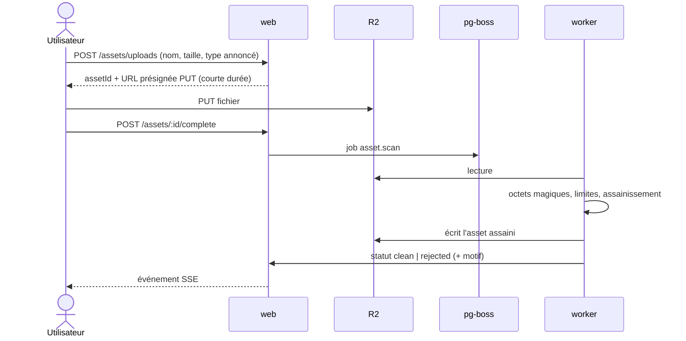
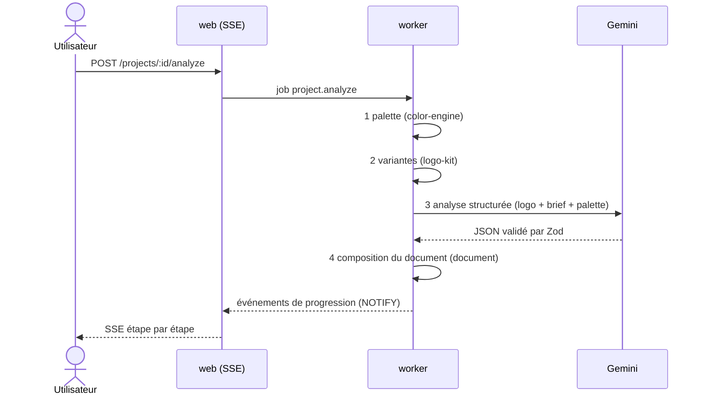
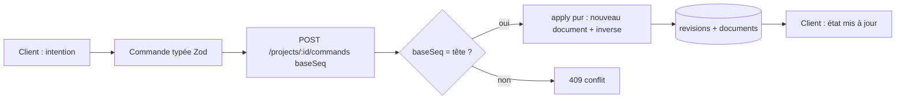
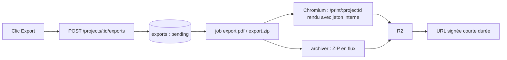

# 02 — Architecture

> Statut : **validé** — Version 4.0 — 2026-10-07
> Remplace : `ARCHITECTURE.md`, `FREE_STACK_AND_ARCHITECTURE.md`, `BACKEND_AND_USER_MANAGEMENT.md`, `SCALABILITY_PERFORMANCE.md`.
> Décisions justifiées dans `14_ADR_LOG.md`.

## 1. Principes

1. **Un langage, un monorepo** : TypeScript de bout en bout, schémas partagés (Zod) entre client, serveur et worker.
2. **Modulaire, pas distribué** : un monolithe modulaire déployé en deux processus (web et worker). Pas de microservices.
3. **Domaine pur** : la logique métier (couleur, document, SVG, variantes) vit dans des packages **sans dépendance** à Next.js, à la base ou au réseau, testables sans infrastructure.
4. **Le serveur fait le minimum** : authentification, persistance, appels IA (clé secrète), scan des fichiers, exports. Le rendu des mockups et l'aperçu sont côté navigateur.
5. **Ports et adaptateurs là où c'est utile** : IA, stockage, file de tâches, e-mail. Pas de cérémonie ailleurs.

## 2. Stack

Les versions sont celles des dernières versions stables **au moment de T-001**, épinglées exactement dans `pnpm-lock.yaml` et consignées dans l'ADR-002. Le framework web est la branche active de Next.js (au 2026-10-07 : Next.js 16 ; la branche 15 atteint sa fin de support le 2026-10-21).

| Couche | Choix | Notes |
|---|---|---|
| Gestionnaire | pnpm + Turborepo | Cache des tâches, filtrage par package |
| Langage | TypeScript strict | `noUncheckedIndexedAccess`, `exactOptionalPropertyTypes`, `verbatimModuleSyntax` |
| Web | Next.js (App Router) + React | Composants serveur par défaut |
| Style | Tailwind CSS v4 (`@theme` en CSS) + shadcn/ui | Tokens OKLCH |
| Animation | Motion (ex-Framer Motion) | Respect de `prefers-reduced-motion` |
| État client | Zustand (éditeur), TanStack Query (données serveur) | |
| Validation | Zod | Source unique des types de contrat |
| Base | PostgreSQL + Drizzle ORM + drizzle-kit | Migrations versionnées |
| Auth | Bibliothèque TypeScript à cookies de session (candidat : Better Auth, validé en T-013) | Alternative : Auth.js |
| File de tâches | pg-boss (dans PostgreSQL) | Pas de Redis |
| Stockage | Cloudflare R2 (API S3) | URL présignées |
| Image serveur | sharp (raster), resvg (rasterisation SVG, processus isolé) | |
| Vectorisation | vtracer (candidat, spike T-011) | |
| CMJN | LittleCMS (WASM ou binaire, spike T-010) | |
| PDF | Playwright + Chromium, dans le worker | Mêmes composants que l'éditeur |
| IA | Gemini via SDK officiel, port `AiPort` | `docs/07_AI_COPILOT.md` |
| Logs | pino (JSON) | |
| Erreurs | Sentry (ou GlitchTip auto-hébergé) | |
| Tests | Vitest, Testing Library, Playwright, fast-check | |
| Qualité | ESLint (typescript-eslint strict), Prettier, dependency-cruiser, gitleaks | |

## 3. Structure du monorepo

```
/
├── apps/
│   ├── web/                    # Next.js : UI, routes API, SSE
│   └── worker/                 # Node : scan, analyse, exports (pg-boss)
├── packages/
│   ├── contracts/              # Schémas Zod, types, codes d'erreur
│   ├── color-engine/           # PUR : conversions, WCAG, extraction, échelles
│   ├── document/               # PUR : AST, commandes, inverses, migrations de schéma
│   ├── svg-engine/             # Assainissement, bbox, rasterisation (isolée), monochrome
│   ├── logo-kit/               # PUR : variantes, favicon, clear space, do/don't
│   ├── mockup-engine/          # NAVIGATEUR : WebGL, homographie, finitions
│   ├── ai/                     # Port + adaptateur Gemini + prompts + évaluation
│   └── db/                     # Schéma Drizzle, migrations, requêtes
├── assets/
│   ├── scenes/                 # Scènes de mockup (images + JSON), licences incluses
│   ├── fonts/                  # Polices auto-hébergées (OFL), licences incluses
│   └── icc/                    # Profils ICC (licences incluses)
├── docs/
├── infra/                      # Docker, Caddy, scripts de sauvegarde
├── AGENTS.md
└── README.md
```

## 4. Règles de dépendances (appliquées par dependency-cruiser)

```
contracts, color-engine           → (rien)
document                          → contracts, color-engine
svg-engine                        → contracts
logo-kit                          → svg-engine, color-engine, contracts
mockup-engine                     → contracts          (navigateur seulement)
db                                → contracts
ai                                → contracts, document
apps/web, apps/worker             → tous les packages
```

Interdits : cycles ; `apps/*` importé par un package ; accès à `process`, `fs`, `fetch`, `Date.now()` ou `Math.random()` non injectés dans `color-engine`, `document`, `logo-kit`.

## 5. Flux principaux

### 5.1 Dépôt et scan d'un logo



Un asset est inutilisable tant que son statut n'est pas `clean`.

### 5.2 Analyse d'un projet



Les étapes 1 et 2 sont déterministes et **ne dépendent pas de l'IA** : si l'IA échoue, l'utilisateur obtient quand même palette et variantes, et une relance de l'étape 3 est proposée.

### 5.3 Édition par commandes



Les commandes proviennent de l'interface **ou** du copilote ; le chemin d'application est identique.

### 5.4 Exports



La route `/print/*` n'est accessible qu'avec un jeton interne à usage unique émis par le worker.

### 5.5 Mockups

Le navigateur rend la scène (WebGL) à la résolution demandée. Le résultat final (3840 × 2160) est téléversé comme asset `mockup_render`, indexé par un **hash de contenu** (`scène + finition + variante de logo + couleurs utilisées`). Le PDF et le ZIP utilisent ces assets. Si un rendu manque, l'export le signale et l'utilisateur est invité à ouvrir la page mockups pour le produire. Le rendu serveur par Chromium est au backlog.

## 6. Configuration

Toute la configuration vient de variables d'environnement, **validées par Zod au démarrage** ; l'application refuse de démarrer si une variable manque.

| Variable | Rôle |
|---|---|
| `DATABASE_URL` | PostgreSQL |
| `R2_ACCOUNT_ID`, `R2_ACCESS_KEY_ID`, `R2_SECRET_ACCESS_KEY`, `R2_BUCKET` | Stockage |
| `AI_PROVIDER`, `AI_MODEL`, `AI_API_KEY` | IA (le modèle n'est **jamais** codé en dur) |
| `AI_DAILY_BUDGET_EUR`, `AI_USER_DAILY_TOKENS` | Plafonds de coût |
| `AUTH_SECRET`, `APP_URL` | Sessions |
| `TURNSTILE_SECRET`, `TURNSTILE_SITE_KEY` | Anti-bot |
| `EMAIL_API_KEY`, `EMAIL_FROM` | E-mails transactionnels |
| `SENTRY_DSN` | Erreurs |
| `INTERNAL_PRINT_SECRET` | Jeton de la route `/print` |

Un fichier `.env.example` documente chaque variable sans valeur réelle.

## 7. Observabilité

- Logs JSON (pino) avec `requestId`, `projectId`, `jobId` ; **jamais** de contenu utilisateur ni de secret.
- Métriques : durée par type de job, taille de la file, tokens IA et coût estimé par appel, taux d'échec des exports.
- Alertes : file bloquée plus de 5 min, taux d'erreur IA > 10 %, coût journalier > 80 % du plafond, espace disque > 80 %.
- Contrôle de disponibilité externe sur `/api/health` (vérifie base, stockage, file).

## 8. Performance (budgets)

| Mesure | Budget |
|---|---|
| LCP, INP, CLS (p75, terrain) | ≤ 2,5 s, ≤ 200 ms, ≤ 0,1 |
| JavaScript initial de la landing | ≤ 200 Ko gzip |
| JavaScript initial du studio | ≤ 350 Ko gzip ; `mockup-engine` chargé à la demande |
| Retour visuel d'une interaction | ≤ 100 ms |
| Éditeur : fluidité | 60 images/s sur l'ordinateur de référence ; mode dégradé automatique en dessous |
| Aperçu de page hors écran | Rendu basse définition ; haute définition seulement dans le viewport ±1 page |

Les budgets sont vérifiés en CI (Lighthouse CI sur landing et studio, taille de bundle).

## 8 bis. Internationalisation

Français (par défaut) et anglais. Tous les textes passent par une bibliothèque i18n du premier jour (candidat : next-intl). Les polices du catalogue doivent supporter les caractères accentués.

## 9. Évolutivité

Seuils qui déclenchent une évolution (et non une anticipation) :
- file `export.*` > 10 min d'attente moyenne → ajouter un second worker ;
- CPU web > 70 % soutenu → séparer web et base sur deux machines ;
- stockage R2 > quelques dizaines de Go → politique de purge des rendus anciens.

Aucune de ces évolutions n'est à coder avant d'être mesurée.
