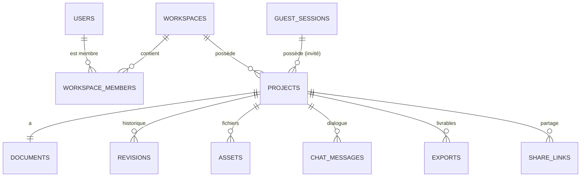

# 03 — Modèle de données

> Statut : **validé** — Version 4.0 — 2026-10-07
> Remplace : schéma de `CAHIER_DES_CHARGES.md` §4 et `STUDIO_WORKSPACE_ENGINE.md` §3.

## 1. Règles générales

- Identifiants : **UUID v7** générés côté application (ordonnés dans le temps, bons pour les index et la pagination par curseur). Exception : les tables gérées par la bibliothèque d'authentification gardent leurs identifiants (texte).
- Horodatages : `timestamptz`, UTC, `created_at` et `updated_at` partout.
- Suppression : **suppression logique** (`deleted_at`) puis **purge définitive** par job planifié. La suppression de compte déclenche la purge sous 24 h (`08_SECURITY_PRIVACY.md`).
- Contenu JSON : colonnes `jsonb`, jamais `text`. Chaque colonne `jsonb` est validée par un schéma Zod à l'écriture **et** à la lecture.
- Concurrence : colonne `version` / `seq` pour le verrouillage optimiste.
- Migrations : drizzle-kit, versionnées dans le dépôt. Jamais de modification manuelle de la base. Jamais de synchronisation automatique en production.
- Pas d'index spéculatif : un index est ajouté quand une requête le justifie (mesure à l'appui).

## 2. Schéma



## 3. Tables

Les types sont indicatifs ; l'implémentation Drizzle fait foi une fois le ticket T-004 livré et revu.

```sql
-- Gérées par la bibliothèque d'authentification : user, session, account, verification.
-- On référence user.id (text).

CREATE TABLE workspaces (
  id            uuid PRIMARY KEY,
  name          text NOT NULL,
  owner_user_id text NOT NULL REFERENCES "user"(id),
  created_at    timestamptz NOT NULL DEFAULT now(),
  deleted_at    timestamptz
);
-- MVP : un espace personnel créé automatiquement par utilisateur.

CREATE TYPE member_role AS ENUM ('owner','editor','viewer');
CREATE TABLE workspace_members (
  workspace_id uuid NOT NULL REFERENCES workspaces(id),
  user_id      text NOT NULL REFERENCES "user"(id),
  role         member_role NOT NULL,
  PRIMARY KEY (workspace_id, user_id)
);

CREATE TABLE guest_sessions (
  id                 uuid PRIMARY KEY,
  token_hash         text NOT NULL UNIQUE,   -- SHA-256 du jeton du cookie
  created_at         timestamptz NOT NULL DEFAULT now(),
  expires_at         timestamptz NOT NULL,   -- created_at + 24 h
  claimed_by_user_id text REFERENCES "user"(id)
);

CREATE TYPE project_status AS ENUM ('draft','analyzing','ready','failed','archived');
CREATE TABLE projects (
  id               uuid PRIMARY KEY,
  workspace_id     uuid REFERENCES workspaces(id),
  guest_session_id uuid REFERENCES guest_sessions(id),
  title            text NOT NULL,
  industry_label   text,                     -- texte libre de l'utilisateur
  scene_category   text,                     -- catégorie du catalogue de scènes (classée par l'IA)
  language         text NOT NULL DEFAULT 'fr',
  brief_text       text,                     -- ≤ 8 000 caractères
  status           project_status NOT NULL DEFAULT 'draft',
  created_at       timestamptz NOT NULL DEFAULT now(),
  updated_at       timestamptz NOT NULL DEFAULT now(),
  deleted_at       timestamptz,
  CHECK ((workspace_id IS NOT NULL) <> (guest_session_id IS NOT NULL))  -- exactement un propriétaire
);

CREATE TABLE documents (                      -- l'état courant
  project_id     uuid PRIMARY KEY REFERENCES projects(id),
  schema_version int  NOT NULL,
  body           jsonb NOT NULL,              -- voir §4
  seq            bigint NOT NULL,             -- numéro de la dernière révision appliquée
  updated_at     timestamptz NOT NULL DEFAULT now()
);

CREATE TYPE actor_kind AS ENUM ('user','ai','system');
CREATE TABLE revisions (
  id          uuid PRIMARY KEY,
  project_id  uuid NOT NULL REFERENCES projects(id),
  seq         bigint NOT NULL,
  actor       actor_kind NOT NULL,
  command     jsonb NOT NULL,                 -- commande appliquée (Zod)
  inverse     jsonb NOT NULL,                 -- commande inverse
  snapshot    jsonb,                          -- document complet toutes les 25 révisions
  created_at  timestamptz NOT NULL DEFAULT now(),
  UNIQUE (project_id, seq)
);

CREATE TYPE asset_kind AS ENUM
  ('logo_original','logo_sanitized','logo_variant','brief_doc','mockup_render','export_pdf','export_zip');
CREATE TYPE asset_status AS ENUM ('pending','quarantined','clean','rejected');
CREATE TABLE assets (
  id            uuid PRIMARY KEY,
  project_id    uuid NOT NULL REFERENCES projects(id),
  kind          asset_kind NOT NULL,
  status        asset_status NOT NULL DEFAULT 'pending',
  storage_key   text NOT NULL UNIQUE,
  sha256        text,
  mime          text,                         -- déterminé par les octets, pas annoncé
  bytes         bigint,
  width         int,
  height        int,
  reject_reason text,                         -- code stable (voir 04_API_CONTRACTS.md)
  meta          jsonb NOT NULL DEFAULT '{}',  -- ex. score IoU, avertissements
  created_at    timestamptz NOT NULL DEFAULT now(),
  deleted_at    timestamptz
);
CREATE INDEX assets_project_kind ON assets (project_id, kind);

CREATE TABLE chat_messages (
  id             uuid PRIMARY KEY,
  project_id     uuid NOT NULL REFERENCES projects(id),
  role           text NOT NULL CHECK (role IN ('user','assistant')),
  content        text NOT NULL,
  target_page_id text,                        -- portée de la consigne
  revision_seqs  bigint[] NOT NULL DEFAULT '{}',  -- révisions provoquées
  created_at     timestamptz NOT NULL DEFAULT now()
);
CREATE INDEX chat_project_created ON chat_messages (project_id, created_at);

CREATE TYPE export_kind AS ENUM ('pdf','zip');
CREATE TYPE export_status AS ENUM ('pending','running','done','failed');
CREATE TABLE exports (
  id         uuid PRIMARY KEY,
  project_id uuid NOT NULL REFERENCES projects(id),
  kind       export_kind NOT NULL,
  status     export_status NOT NULL DEFAULT 'pending',
  asset_id   uuid REFERENCES assets(id),
  error_code text,
  attempts   int NOT NULL DEFAULT 0,
  created_at timestamptz NOT NULL DEFAULT now()
);

CREATE TABLE share_links (
  id         uuid PRIMARY KEY,
  project_id uuid NOT NULL REFERENCES projects(id),
  token_hash text NOT NULL UNIQUE,
  expires_at timestamptz NOT NULL,
  revoked_at timestamptz,
  created_at timestamptz NOT NULL DEFAULT now()
);

CREATE TABLE usage_events (                  -- comptabilité des coûts
  id               uuid PRIMARY KEY,
  user_id          text REFERENCES "user"(id),
  guest_session_id uuid REFERENCES guest_sessions(id),
  kind             text NOT NULL,            -- 'ai.analyze' | 'ai.copilot' | 'export.pdf' | ...
  model            text,
  tokens_in        int,
  tokens_out       int,
  est_cost_micro_eur bigint,                 -- estimation, en millionièmes d'euro
  created_at       timestamptz NOT NULL DEFAULT now()
);
CREATE INDEX usage_user_day ON usage_events (user_id, created_at);

CREATE TABLE audit_log (                     -- non identifiant à long terme
  id         uuid PRIMARY KEY,
  actor_ref  text NOT NULL,                  -- identifiant haché
  action     text NOT NULL,
  subject    text,
  created_at timestamptz NOT NULL DEFAULT now()
);
```

La file de tâches est gérée par **pg-boss** dans son propre schéma ; on n'y écrit pas à la main.

## 4. Le document de marque

Un projet a **un seul document JSON** (`documents.body`). Il contient les tokens globaux et les pages. Avantage : une commande = une transaction = un seul numéro de version ; l'annulation est simple.

```ts
// packages/document — référence de forme (le code Zod fait foi)
type BrandDocument = {
  schemaVersion: number;
  brand: {
    name: string;
    mission: string;
    vision: string;
    values: [string, string, string, string];
    archetype: Archetype;                       // 12 archétypes, voir 07_AI_COPILOT.md
    tone: { axes: ToneAxis[]; examples: string[] };
  };
  tokens: {
    colors: {
      primary: ColorToken; accent: ColorToken;
      neutralLight: ColorToken; neutralDark: ColorToken;
      extra: ColorToken[];                      // 0 à 4 couleurs supplémentaires
    };
    typography: { pairingId: string };          // id du catalogue fermé
    logo: { clearSpaceRatio: number; minSizePx: number; minSizeMm: number };
  };
  assets: { logoSanitizedId: string; variants: VariantRef[] };
  pages: Page[];
};

type ColorToken = {
  hex: string;                                  // '#RRGGBB' majuscules
  source: 'extracted' | 'derived' | 'user';
};

type Page = {
  id: string;                                   // stable, jamais un index
  type: PageType;
  position: string;                             // clé de tri fractionnaire
  title: string;
  data: Record<string, unknown>;                // validé par un schéma par PageType
  overrides: Partial<PageOverrides>;            // surcharges locales (fond, mise en page)
};
```

Règles :
- **Héritage** : une page lit les tokens globaux, sauf si `overrides` définit une valeur locale. Une commande globale ne touche jamais `overrides`.
- Les pages sont adressées **par `id`**, jamais par position.
- `schemaVersion` + fonctions de migration pures dans `packages/document` ; un document ancien est migré à la lecture.
- Taille maximale d'un document : 512 Ko (refus sinon).

## 5. Révisions et Time-Machine

- Chaque commande appliquée crée une révision (`seq` croissant sans trou par projet).
- `inverse` est calculée **au moment de l'application** par la fonction pure `apply(doc, command) → { doc, inverse }`.
- **Annuler** applique `inverse` comme **nouvelle révision** (historique linéaire). **Rétablir** est géré par une pile côté client, valable pendant la session.
- Un `snapshot` est enregistré toutes les 25 révisions pour limiter le rejeu.
- Rétention : 500 révisions par projet ; les plus anciennes sont compactées en snapshot.

## 6. Cycle de vie des données (RGPD)

| Donnée | Rétention | Purge |
|---|---|---|
| Projet invité et assets | 24 h | Job horaire |
| Projet utilisateur | Tant que le compte existe | À la suppression du projet ou du compte (≤ 24 h) |
| Assets originaux téléversés | Tant que le projet existe | Idem |
| `usage_events` | 13 mois | Job mensuel |
| `audit_log` | 12 mois, non identifiant | Job mensuel |
| Logs applicatifs | 30 jours | Rotation |
| Sauvegardes de base | 14 jours | Rotation ; l'effacement s'y propage au plus tard après 14 jours (à indiquer dans la politique de confidentialité) |

## 7. Autorisation

Une seule fonction `can(actor, action, resource)` décide de tout accès (`08_SECURITY_PRIVACY.md` §4). Aucune requête n'accède à un projet sans passer par elle. Un acteur est un utilisateur authentifié, une session invitée, un lien de partage (lecture seule) ou le système.
