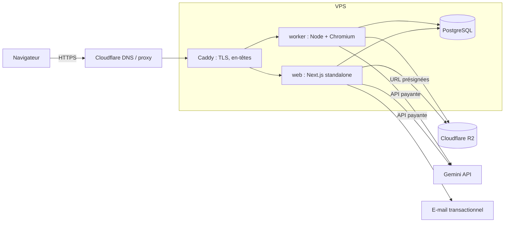

# 11 — Infrastructure, exploitation et budget

> Statut : **validé** — Version 4.0 — 2026-10-07
> Remplace : `FREE_STACK_AND_ARCHITECTURE.md` §1.6 et le « 0 € » de l'ancien CDC.
> Les prix et quotas des fournisseurs changent : **tout chiffre ci-dessous est un ordre de grandeur à vérifier à la date d'achat.**

## 1. Principe

Un petit serveur payant, simple et reproductible, vaut mieux qu'un empilement de paliers gratuits fragiles. Pas de Kubernetes, pas de microservices, pas de serverless pour le worker.

## 2. Topologie



- Un seul VPS au départ, trois conteneurs applicatifs (`web`, `worker`, `postgres`) et `caddy`, orchestrés par Docker Compose.
- Domaine géré chez le registrar de ton choix, DNS chez Cloudflare (proxy activé, mode SSL strict).
- Un sous-domaine séparé (`assets.<domaine>`) sert les assets utilisateur sans cookies de session.

## 3. Dimensionnement de départ

| Ressource | Départ | Raison |
|---|---|---|
| vCPU | 4 | Rendu PDF et scan d'images concurrents |
| Mémoire | 8 Go | Chromium (≈ 300 à 600 Mo par rendu), PostgreSQL, Next.js |
| Disque | 80 Go SSD | Base, journaux, tampons ; les fichiers sont dans R2 |
| Concurrence du worker | 2 jobs lourds | Évite les dépassements mémoire |

Choisis la **région** du serveur en fonction de la majorité de tes utilisateurs visés. Prends un hébergeur qui propose **instantanés** et **sauvegardes** de machine.

## 4. Environnements

| Env | Usage | Hébergement |
|---|---|---|
| `local` | Développement | Docker Compose local (PostgreSQL) |
| `staging` | Recette | Même VPS, projet Compose séparé, sous-domaine `staging.`, base distincte, **clé IA distincte à plafond bas** |
| `prod` | Production | VPS, Compose de production |

Les secrets sont différents par environnement. Aucune donnée de production dans `staging`.

## 5. Déploiement

- Images construites en CI, poussées dans un registre privé ; le serveur tire une image **identifiée par un hash**.
- Déploiement : script `infra/deploy.sh` (SSH + `docker compose pull && up -d`) puis **contrôle de santé** (`/api/health`) ; retour arrière automatique à l'image précédente si le contrôle échoue.
- Migrations de base : exécutées par un conteneur dédié **avant** le démarrage de la nouvelle version ; **rétro-compatibles d'une version** (expand/contract) pour permettre le retour arrière.
- Option : un PaaS auto-hébergé (Coolify, Dokploy) si le script devient pénible. Décision par ADR.

## 6. Sauvegardes et reprise

| Élément | Fréquence | Rétention | Test |
|---|---|---|---|
| PostgreSQL (`pg_dump` chiffré) | Quotidienne | 14 jours | **Restauration testée chaque mois** |
| Instantané de la machine | Hebdomadaire | 4 | Annuel |
| R2 (assets) | Versionnement du bucket | 14 jours | Test de restauration d'un objet |
| Secrets | Gestionnaire de mots de passe de l'équipe | — | — |

Les sauvegardes sont poussées vers un **stockage distinct** du serveur (un autre bucket R2, ou un autre fournisseur). Objectifs : **RPO ≤ 24 h**, **RTO ≤ 4 h**. Un **runbook** `infra/RUNBOOK.md` décrit : déploiement, retour arrière, restauration de la base, rotation des clés, réponse à incident.

## 7. Supervision

- Disponibilité : sonde externe sur `/api/health` (toutes les 1 min) avec alerte par e-mail ou messagerie.
- Erreurs : Sentry (ou GlitchTip auto-hébergé), avec masquage des données.
- Métriques : durée des jobs, taille de la file, tokens et coût IA, taux d'échec des exports, mémoire et disque du serveur.
- Journaux : conteneurs → rotation locale 30 jours.
- Alertes : celles de `02_ARCHITECTURE.md` §7.

## 8. Sécurité de l'hôte

- Accès SSH par clé uniquement, utilisateur non root, port changé ou restreint par pare-feu, Fail2ban.
- Pare-feu : seuls 80/443 ouverts ; PostgreSQL non exposé.
- Mises à jour de sécurité automatiques de l'OS ; images de base mises à jour chaque mois.
- Chromium lancé avec un utilisateur dédié sans privilèges, dans un conteneur sans accès au réseau interne hors nécessité.

## 9. E-mail transactionnel et domaine

Un fournisseur d'e-mail transactionnel est requis (vérification de compte, réinitialisation). Configurer **SPF, DKIM et DMARC** sur le domaine avant le premier envoi. Le domaine d'envoi est distinct de la boîte personnelle.

## 10. Budget (ordres de grandeur, à valider)

| Poste | Fréquence | Ordre de grandeur | Remarque |
|---|---|---|---|
| VPS 4 vCPU / 8 Go | Mensuel | quelques dizaines d'euros au plus | À comparer entre 2 ou 3 hébergeurs |
| Nom de domaine | Annuel | environ 10 à 25 € | Vérifier le prix de renouvellement |
| Cloudflare R2 | Mensuel | quasi nul au départ | Frais de sortie nuls ; surveiller le volume des rendus 4K |
| Sauvegardes externes | Mensuel | quasi nul à quelques euros | |
| E-mail transactionnel | Mensuel | gratuit à quelques euros au départ | Selon volume |
| Suivi d'erreurs | Mensuel | gratuit au départ | |
| **API IA** | À l'usage | **variable, plafonnée** | Voir §11 |
| Textes juridiques (relecture) | Ponctuel | à budgéter | Avant la bêta |

L'abonnement grand public à l'assistant de code (déjà détenu) n'est **pas** un coût d'exploitation du produit.

## 11. Modèle de coût IA

```
coût_charte = tokens_entrée × prix_entrée + tokens_sortie × prix_sortie
  entrée  ≈ logo (image réduite) + brief (≤ 8 000 caractères) + palette + catalogues + consignes
  sortie  ≈ ≤ 2 000 tokens (analyse)
copilote : ≈ contexte du document + historique + ≤ 1 000 tokens de sortie, par tour
```

Étapes :
1. Relever les **prix actuels du modèle retenu** (`AI_MODEL`) sur la page officielle, à la date d'achat.
2. Mesurer sur le jeu d'or (40 marques) : tokens réels moyens et p95 en entrée et sortie.
3. Calculer `coût_moyen` et `coût_p95` par charte et par tour de copilote.
4. Fixer les **plafonds** : `AI_DAILY_BUDGET_EUR`, `AI_USER_DAILY_TOKENS`, limites de tours.
5. Le prix de vente (ou le quota gratuit) est décidé **après** cette mesure : marge visée ≥ 70 % sur le plan payant.

Le tableau de bord de coûts s'alimente des `usage_events`.

## 12. Évolutions déclenchées par des mesures

Voir `02_ARCHITECTURE.md` §9. Ordre probable : second worker → séparation base de données → purge des rendus anciens → CDN devant les assets publics.
