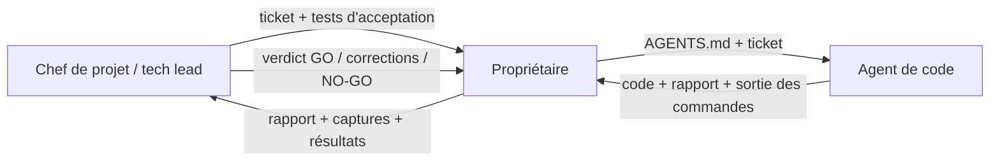

# 12 — Méthode de travail et feuille de route

> Statut : **validé** — Version 4.0 — 2026-10-07

## 1. Rôles et circulation de l'information



L'agent de code n'a pas de canal direct avec le chef de projet : **le propriétaire fait le relais**. Tout doit donc tenir dans le ticket et dans le rapport.

## 2. Cycle d'un ticket

1. **Cadrage** (chef de projet) : le ticket est écrit selon le gabarit du §4. Il référence les documents à lire, liste les fichiers autorisés, les interdits et les tests d'acceptation.
2. **Lancement** (propriétaire) : nouvelle session de l'agent, `AGENTS.md` en contexte, puis le prompt du §3.
3. **Réalisation** (agent) : branche dédiée, tests d'abord, code, `pnpm verify`, test de sabotage, rapport.
4. **Relais** (propriétaire) : colle le rapport **complet**, la sortie des commandes, les captures d'écran (UI, mockups) et signale tout comportement étrange.
5. **Revue** (chef de projet) : checklist §6, verdict.
6. **Correction** si besoin : une liste de corrections numérotée, renvoyée à l'agent. Maximum 2 allers-retours ; au-delà, le ticket est redécoupé.
7. **Fusion** (propriétaire) : après GO. Le chef de projet met à jour le suivi.

Un ticket ne reste jamais « presque fini » : il est GO, ou renvoyé avec des corrections précises.

## 3. Prompt à coller à l'agent (début de session)

```
Tu es l'agent de code du projet. Lis d'abord AGENTS.md à la racine.
Puis exécute le ticket ci-dessous, en respectant strictement ses périmètres.
Rappels : tests d'abord ; aucune dépendance non autorisée ; aucune décision
d'architecture ; si la spécification est ambiguë, écris un BLOCKER au lieu de deviner ;
termine par le rapport au format imposé, avec la sortie réelle de `pnpm verify`.

[coller le ticket ici]
```

Règle d'hygiène : **une session = un ticket.** Pas de long fil qui dérive ; une session neuve limite les oublis et les « souvenirs » faux.

## 4. Gabarit de ticket

```
# T-0xx — Titre court
**Phase** : P1   **Taille** : S | M | L (L interdit : découper)   **Dépend de** : T-0yy

## Objectif
Une phrase : ce qui existe à la fin et qui n'existait pas.

## À lire
- docs/…  (sections précises)

## Périmètre
**Fichiers autorisés** : liste de chemins
**Interdits** : ce qu'on ne touche pas

## Spécification
Entrées, sorties, algorithmes (renvoi aux formules de docs/05_ENGINES.md), cas limites.

## Tests d'acceptation
Liste numérotée, chacun exécutable (nom de fichier de test, commande).
Vecteurs de référence à utiliser.

## Hors périmètre
Ce que l'agent pourrait être tenté d'ajouter.

## Définition de fini
Renvoi à docs/10_QUALITY.md §4 + critères propres au ticket.
```

## 5. Définition de « prêt » (Definition of Ready)

Un ticket est lançable si : l'objectif tient en une phrase ; les documents à lire existent et sont à jour ; les tests d'acceptation sont écrits et exécutables ; il ne dépend d'aucun ticket non terminé ; sa taille est S ou M (< 400 lignes hors tests).

## 6. Revue du chef de projet

Checklist :
1. **Conformité** au ticket et à la spécification (aucun écart non justifié).
2. **Tests** : les assertions sont-elles significatives ? Le test de sabotage a-t-il été fait ? Les vecteurs de référence sont-ils intacts ?
3. **Sécurité** (`08_SECURITY_PRIVACY.md` §6).
4. **Typage et lisibilité** : zéro `any`, fonctions courtes, pas de code mort.
5. **Dépendances** : aucune non autorisée.
6. **Périmètre** : aucun fichier hors liste.
7. **Honnêteté du rapport** : tout ce qui est annoncé est prouvé par une sortie.
8. Pour l'UI : accessibilité (clavier, axe), tokens, captures cohérentes.

Verdicts : **GO** · **CORRECTIONS** (liste numérotée, référencée aux fichiers) · **NO-GO** (redécoupage ou nouvelle spécification).

Le chef de projet peut demander à voir un fichier précis, un diff ou la sortie d'une commande. Il ne valide jamais « sur la foi » d'un rapport seul pour les modules critiques (sanitizer, `can()`, moteurs de couleur).

## 7. Gel du code existant

Le code déjà produit (landing, dashboard, studio statique, backend Spring) est **gelé** :
- **Spring Boot** : archivé tel quel (dépôt ou dossier `_archive/`), non maintenu.
- **Landing, dashboard, studio** : conservés comme **référence visuelle**. Aucune de ces interfaces n'est reprise automatiquement ; elles sont réintégrées **composant par composant** via tickets (réécrits avec tokens, i18n, accessibilité, sans chiffres inventés).
- Aucun nouveau travail visuel sur la landing avant la bêta.

## 8. Faiblesses connues de l'agent et contre-mesures

Ces faiblesses sont celles que montrent les assistants de code en général ; elles sont **complétées par ton observation** (voir §11 : dis-moi lesquelles tu as vues, j'ajoute des garde-fous).

| Faiblesse | Risque | Contre-mesure dans le dispositif |
|---|---|---|
| API ou paquet inventé, version ancienne | Code qui ne compile pas ou obsolète | « Vérifie dans la version installée » (`AGENTS.md` §3) ; versions épinglées |
| Formules de mathématiques ou de couleur approximatives | Résultats faux mais plausibles | Formules **données** dans la spécification ; vecteurs externes ; test de sabotage |
| Shaders / WebGL | Rendu subtilement faux | Formules fournies ; tests numériques ; **revue visuelle humaine** (`06_MOCKUP_ENGINE.md` §7) |
| Tests qui ne testent rien | Fausse confiance | Assertions significatives imposées ; sabotage ; revue des tests |
| Dérive de périmètre (« j'ai aussi ajouté… ») | Dette, bugs | Liste de fichiers autorisés ; « hors périmètre » explicite ; tickets petits |
| Sécurité oubliée (autorisation, validation) | Failles | `can()` central ; checklist ; tests d'accès par route générés |
| Sur-ingénierie | Complexité | Règle « pas de dépendance sans autorisation » ; revue de simplicité |
| Dépendances ajoutées sans demander | Surface d'attaque, maintenance | Interdit ; audit en CI |
| Hallucination de résultats (« tests passés ») | Faux rapports | Sortie réelle exigée ; le chef de projet peut refaire |
| Perte de contexte sur longues sessions | Contradictions | Une session = un ticket ; documents comme mémoire |
| Gestion d'erreurs absente (« happy path ») | Plantages | Erreurs comme valeurs, cas limites listés dans les tickets |
| Accessibilité négligée | Non-conformité | Checklist ; axe en CI ; revue clavier |

## 9. Feuille de route

> Les durées sont des **ordres de grandeur** pour une personne avec un agent de code, à raison d'un travail soutenu. Elles seront recalibrées à la fin de la Phase 1 (vitesse réelle mesurée).

| Phase | Contenu | Durée | Sortie (critère de passage) |
|---|---|---|---|
| **P0 — Fondations** | Monorepo, CI, base locale, config validée, nom choisi, infra squelette | ≈ 1 semaine | `pnpm verify` vert en CI ; déploiement d'une page de santé sur le VPS |
| **P1 — Moteurs** | `color-engine`, `svg-engine`, `logo-kit` + spikes ICC et vectorisation | ≈ 3 semaines | Golden vectors OK ; corpus d'attaque 30/30 ; 20 logos : palettes et variantes validés par le propriétaire |
| **P2 — Document et studio** | `document` + commandes, base, auth, mode invité, upload, éditeur et pages de charte | ≈ 3 semaines | Parcours : logo → charte affichée → modifications annulables |
| **P3 — Livrables** | Moteur de mockups + 3 scènes, PDF, ZIP | ≈ 3 à 4 semaines | Export complet ; mockups validés visuellement |
| **P4 — IA et copilote** | Adaptateur Gemini, analyse, copilote, évaluation, plafonds | ≈ 2 semaines | Jeu d'or : seuils de `07_AI_COPILOT.md` §5 atteints |
| **P5 — Bêta** | Durcissement, textes juridiques, observabilité, accessibilité manuelle, tarification | ≈ 2 à 3 semaines | Revue de sécurité, restauration testée, 10 testeurs réels |

Total indicatif : **14 à 16 semaines.** Les phases ne se chevauchent pas (une seule personne et un agent).

### Spikes (explorations bornées)

| Spike | Question | Durée | Livrable |
|---|---|---|---|
| T-010 ICC CMJN | Quelle bibliothèque donne un CMJN FOGRA39 fiable ? | ≤ 2 jours | Note de décision + test de non-régression |
| T-011 Vectorisation | Quelle qualité sur 20 logos ? Seuil IoU atteignable ? | ≤ 2 jours | Note + corpus de résultats |
| T-013 Auth | La bibliothèque retenue couvre-t-elle e-mail + OAuth + sessions DB ? | ≤ 1 jour | ADR |

Un spike **ne produit pas de code de production** : il produit une décision.

## 10. Rituels

- **Après chaque ticket** : mise à jour du suivi (`PROGRESS_TRACKER.md`).
- **Chaque semaine** : point de 15 minutes (propriétaire + chef de projet) : ce qui est GO, ce qui bloque, risque principal, vitesse réelle.
- **Chaque fin de phase** : démonstration, DoD de jalon (`10_QUALITY.md` §5), mise à jour des risques, recalibrage de la durée des phases suivantes.
- **Chaque mois** : mise à jour des dépendances, vérification des versions de support (framework, modèle IA), test de restauration de sauvegarde.

## 11. Gestion du changement

- Toute demande nouvelle est **notée**, estimée et placée dans le backlog ; elle n'entre dans la phase en cours que si elle remplace une charge équivalente.
- Une idée n'est jamais implémentée « en passant ».
- Les décisions structurantes passent par un **ADR** (`14_ADR_LOG.md`).
- **Ce que le propriétaire doit me dire** pour affiner le dispositif : (1) les faiblesses précises observées chez l'agent ; (2) l'outil de code utilisé (CLI, éditeur) pour que j'adapte le fichier de contexte ; (3) l'ordinateur et le téléphone de référence ; (4) le pays d'établissement et les marchés visés (juridique, paiement, marque).

## 12. Qualité de la documentation

- `docs/` est **la** source de vérité. Un document contradictoire est corrigé ou archivé, jamais ignoré.
- Les ADR sont immuables : on les remplace par un nouvel ADR (statut « supersedé »), on ne les réécrit pas.
- Chaque document porte statut, version, date.
