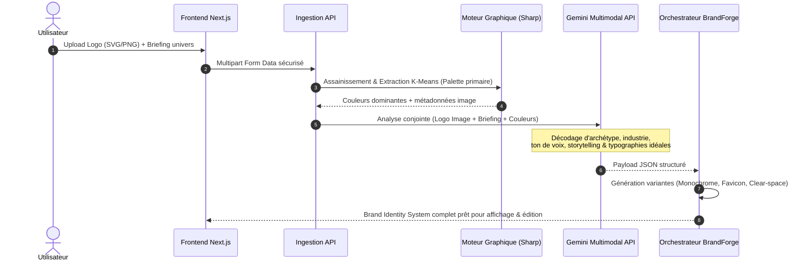
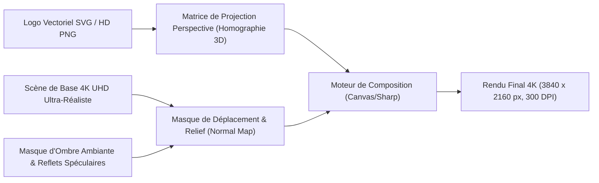

# Spécifications d'Architecture Système & Logicielle
## BrandForge Studio (Ultra Edition)

---

## 1. Principes d'Ingénierie & Clean Architecture

L'application est architecturée selon les principes de la **Clean Architecture (Ports & Adapters)** afin de découpler la logique métier centrale (génération de règles de marque, calculs colorimétriques, projections de mockups) des frameworks et services externes (Next.js, API IA, bases de données, stockage cloud).

```
                      ┌──────────────────────────────────────┐
                      │          INFRASTRUCTURE              │
                      │  Next.js App Router, Gemini API,     │
                      │  PostgreSQL/Drizzle, Sharp, Cloud R2 │
                      │   ┌──────────────────────────────┐   │
                      │   │        APPLICATION           │   │
                      │   │  Use Cases, Orchestrateurs,  │   │
                      │   │  DTOs, Ports d'Interface     │   │
                      │   │   ┌──────────────────────┐   │   │
                      │   │   │       DOMAINE        │   │   │
                      │   │   │  Entités de Marque,  │   │   │
                      │   │   │  Calculs Couleurs,   │   │   │
                      │   │   │  Règles d'Exclusion  │   │   │
                      │   │   └──────────────────────┘   │   │
                      │   └──────────────────────────────┘   │
                      └──────────────────────────────────────┘
```

### 1.1 Couche Domaine (Pure TypeScript, Zéro Dépendance Externe)
* **Entités** : `BrandIdentity`, `LogoAsset`, `ColorPalette`, `TypographySystem`, `MockupScene`.
* **Valeurs-Objets (Value Objects)** : `HexColor`, `CmykColor`, `ContrastRatio`, `ClearSpaceRatio`.
* **Services de Domaine** :
  * Calcul mathématique de luminance relative et ratios WCAG ($L_1 + 0.05) / (L_2 + 0.05)$.
  * Règles d'exclusion et de proportions du logo.
  * Algorithmes d'harmonie colorimétrique (complémentaire, triade, analogue).

### 1.2 Couche Application (Cas d'Utilisation)
* `AnalyzeBrandIdentityUseCase` : Coordonne l'analyse visuelle et sémantique.
* `GenerateLogoVariantsUseCase` : Déclenche la création des versions monochrome, négative et favicon.
* `RenderPhotorealisticMockupUseCase` : Gère l'application perspective et le shader de matière sur les scènes 4K.
* `ExportBrandBookPdfUseCase` : Compile le document vectoriel haute définition 300 DPI.

### 1.3 Couche Infrastructure
* **Adapteurs IA** : Intégration de l'API multimodale Gemini (analyse d'images et génération de storytelling structuré en JSON strict).
* **Moteur d'Image** : Sharp pour le redimensionnement, conversion WebP/PNG, K-Means clustering colorimétrique.
* **Vector Engine** : Potrace / vtracer / svgo pour la vectorisation et l'optimisation des tracés SVG.
* **Persistance** : Drizzle ORM avec PostgreSQL pour l'historique et la sauvegarde des chartes.

---

## 2. Pipeline Multimodal d'Analyse de Marque



---

## 3. Pipeline des Mockups 4K Photoréalistes

Pour garantir une netteté absolue sans les altérations typiques de l'IA générative (qui déforme le texte ou le logo), BrandForge utilise un **système de rendu hybride physique & perspective** :



### 3.1 Shaders de Matière & Finitions Disponibles
1. **Embossage / Débossage** : Simulation de relief sur papier texturé 600g (cartes de visite, papier en-tête) avec ombre portée directionnelle.
2. **Dorure à Chaud (Gold / Silver Foil)** : Masque spéculaire simulant les reflets métalliques sous éclairage studio.
3. **Sérigraphie & Broderie Textile** : Effet de trame de fils entrelacés pour les t-shirts, tote bags et tabliers.
4. **Verre Dépoli & Rétro-éclairage** : Translucidité et réfraction pour les flacons de luxe et enseignes modernes.

---

## 4. Module 3D Interactif & Rendu Vidéo Turnaround (Roadmap V1.5)

* **Moteur 3D Temps Réel** : Three.js via `@react-three/fiber` et `@react-three/drei`.
* **Objets Modélisés** :
  * Carte de visite épaisse avec tranche colorée personnalisable.
  * Packaging cubique / boîte cadeau avec ouverture interactive.
  * Canette aluminium ou flacon avec texture métallique.
* **Pipeline d'Export Vidéo** :
  * Capture d'images séquentielles depuis le canvas WebGL à 60 FPS.
  * Encodage natif via l'API WebCodecs ou rendu serveur en boucle vidéo MP4 / WebM H.264 de 4 à 8 secondes (rotation cinématique 360° avec éclairage dynamique).

---

## 5. Schéma Colorimétrique & Conversion Certifiée

Toute couleur extraite ou modifiée traverse un module de conversion physique strict :

$$\text{HEX} \longleftrightarrow \text{sRGB} \longleftrightarrow \text{Display P3} \longleftrightarrow \text{CMJN (FOGRA39)} \longleftrightarrow \text{Pantone Formula Guide Solid}$$

* **Gestion du Gamut** : Les couleurs RVB non imprimables sont automatiquement mappées vers la nuance CMJN la plus proche sans dénaturation perceptible (distance $\Delta E$ minimale).
* **Validation de Contraste** : Calcul instantané des ratios de contraste texte/fond selon la formule WCAG 2.2 avec alerte si le ratio est inférieur à $4.5:1$ (AA) ou $7:1$ (AAA).
