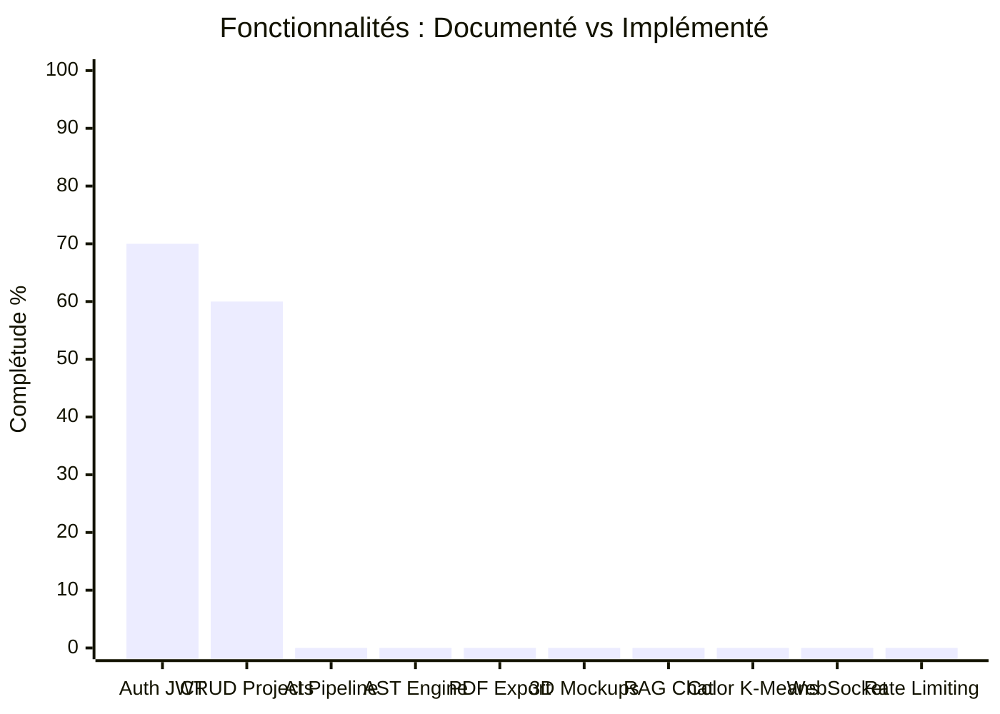

# 🔍 Audit Expert — BrandForge Studio

> **Date :** 5 octobre 2026  
> **Auditeur :** Analyse approfondie multi-agent (Backend, Frontend, Documentation)  
> **Verdict global :** Le projet a une vision ambitieuse et un début de fondation solide, mais souffre de **sur-ingénierie documentaire**, de **failles de sécurité critiques**, et d'un **décalage massif entre la documentation et le code réel**.

---

## 📊 Scorecard Rapide

| Domaine | Note | Commentaire |
|---------|------|-------------|
| 🎨 UI/UX (Visuel) | **7/10** | Très beau visuellement, glassmorphism réussi, mais 100% cosmétique |
| 🏗️ Architecture Backend | **4/10** | Fondation correcte mais configuration dangereuse |
| ⚛️ Architecture Frontend | **5/10** | Bonne structure Next.js mais aucune connexion au backend |
| 🔒 Sécurité | **3/10** | Failles critiques JWT, H2 console, Actuator exposé |
| 📄 Documentation | **3/10** | Ambitieuse mais déconnectée de la réalité du code |
| 🧪 Tests | **0/10** | Aucun test existant |
| 🔗 Intégration Front↔Back | **0/10** | Zéro connexion, tout est en mock data |

---

## 🚨 FAILLES CRITIQUES (à corriger immédiatement)

### 1. Secret JWT en dur dans le code source

**Fichier :** [application.yml](file:///C:/Users/KURO/Documents/Projects/graphic_chart/backend/src/main/resources/application.yml#L42)

```yaml
secret: ${JWT_SECRET:brandforge_super_secure_enterprise_key_2026_at_least_256_bits_long_jwt_secret!}
```

> [!CAUTION]
> Si la variable d'environnement `JWT_SECRET` n'est pas définie (ce qui arrivera en local et potentiellement en prod), n'importe qui ayant vu ce code peut **forger des tokens JWT valides** et usurper l'identité de tout utilisateur. C'est une **vulnérabilité OWASP A07:2021**.

**Fix :** Supprimer la valeur par défaut. En dev, utiliser un fichier `.env` ignoré par git. En prod, exiger la variable d'environnement sans fallback.

---

### 2. Console H2 activée sans restriction d'environnement

**Fichier :** [application.yml](file:///C:/Users/KURO/Documents/Projects/graphic_chart/backend/src/main/resources/application.yml#L34-L37)

```yaml
h2:
  console:
    enabled: true
    path: /h2-console
```

**Fichier :** [SecurityConfig.java](file:///C:/Users/KURO/Documents/Projects/graphic_chart/backend/src/main/java/com/brandforge/security/SecurityConfig.java#L38-L44)

```java
.headers(headers -> headers.frameOptions(HeadersConfigurer.FrameOptionsConfig::disable)) // Pour console H2
// ET
.requestMatchers("/h2-console/**").permitAll()
```

> [!CAUTION]
> La console H2 est exposée sans authentification et les frame options sont désactivées globalement. En production, un attaquant peut accéder à `/h2-console` et exécuter du SQL arbitraire sur votre base de données. **C'est une porte ouverte à l'injection SQL directe et au RCE.**

**Fix :** Utiliser des profils Spring (`application-dev.yml` / `application-prod.yml`). H2 console uniquement en profil `dev`.

---

### 3. Actuator exposé avec détails complets

**Fichier :** [application.yml](file:///C:/Users/KURO/Documents/Projects/graphic_chart/backend/src/main/resources/application.yml#L57-L65)

```yaml
management:
  endpoints:
    web:
      exposure:
        include: health,info,metrics
  endpoint:
    health:
      show-details: always
```

Combiné avec [SecurityConfig.java L45](file:///C:/Users/KURO/Documents/Projects/graphic_chart/backend/src/main/java/com/brandforge/security/SecurityConfig.java#L45) : `"/actuator/**"` est `permitAll()`.

> [!WARNING]
> Les endpoints Actuator sont accessibles sans authentification et exposent des détails sur la base de données, l'état du système, et les métriques JVM. Un attaquant peut utiliser ces informations pour cartographier votre infrastructure.

---

### 4. Exception silencieusement avalée dans le JWT Filter

**Fichier :** [JwtAuthenticationFilter.java](file:///C:/Users/KURO/Documents/Projects/graphic_chart/backend/src/main/java/com/brandforge/security/JwtAuthenticationFilter.java#L62-L64)

```java
} catch (Exception e) {
    // Jeton invalide ou expiré : la requête continue sans authentification
}
```

> [!WARNING]
> Un token JWT malformé ou manipulé ne génère aucun log, aucune alerte. Un attaquant qui bruteforce ou manipule des tokens ne laisse **aucune trace**. Vous devez au minimum logger ces erreurs.

---

## 🏗️ Problèmes d'Architecture Backend

### 5. `ddl-auto: update` en production

**Fichier :** [application.yml L21](file:///C:/Users/KURO/Documents/Projects/graphic_chart/backend/src/main/resources/application.yml#L21)

Hibernate peut modifier le schéma de la base de données automatiquement. En production, cela peut causer :
- Des tables verrouillées pendant les migrations
- Des colonnes ajoutées mais jamais supprimées
- De la perte de données silencieuse

**Fix :** Intégrer **Flyway** ou **Liquibase** pour la gestion des migrations.

---

### 6. Pas de `GlobalExceptionHandler`

Les contrôleurs utilisent des `try/catch` manuels avec `IllegalArgumentException` :

**Fichier :** [AuthController.java](file:///C:/Users/KURO/Documents/Projects/graphic_chart/backend/src/main/java/com/brandforge/web/AuthController.java#L23-L29)

```java
try {
    AuthResponse response = authService.register(request);
    return ResponseEntity.status(HttpStatus.CREATED).body(response);
} catch (IllegalArgumentException e) {
    return ResponseEntity.badRequest().body(Map.of("error", e.getMessage()));
}
```

**Problèmes :**
- Code dupliqué dans chaque endpoint
- Pas de gestion des exceptions inattendues (NullPointer, DB timeout, etc.)
- Les messages d'erreur en français sont directement exposés au client (fuite d'information)

**Fix :** Créer un `@RestControllerAdvice` avec des `@ExceptionHandler` pour chaque type d'erreur, et des exceptions métier custom (`ProjectNotFoundException`, `EmailAlreadyExistsException`, etc.).

---

### 7. Entité `User` n'implémente pas `UserDetails`

**Fichier :** [User.java](file:///C:/Users/KURO/Documents/Projects/graphic_chart/backend/src/main/java/com/brandforge/domain/model/User.java)

La classe `User` est une simple entité JPA. Elle n'implémente pas `UserDetails` de Spring Security. Cela signifie :
- Pas de `UserDetailsService` standard
- L'authentification repose entièrement sur le filtre JWT custom
- `@AuthenticationPrincipal User user` dans les contrôleurs risque de ne pas fonctionner car Spring Security ne sait pas comment résoudre `User` comme principal

---

### 8. Endpoint `/api/v1/auth/me` inutile

**Fichier :** [AuthController.java L42-45](file:///C:/Users/KURO/Documents/Projects/graphic_chart/backend/src/main/java/com/brandforge/web/AuthController.java#L42-L45)

```java
@GetMapping("/me")
public ResponseEntity<?> getMe() {
    return ResponseEntity.ok(Map.of("status", "authenticated"));
}
```

Cet endpoint est sous `/api/v1/auth/**` qui est `permitAll()` ! Il retourne toujours "authenticated" même sans token. Il ne vérifie rien et n'est utile à personne.

---

### 9. Pas de validation des mots de passe

**Fichier :** [RegisterRequest.java](file:///C:/Users/KURO/Documents/Projects/graphic_chart/backend/src/main/java/com/brandforge/web/dto/RegisterRequest.java)

Il n'y a probablement pas de validation de longueur minimum, de complexité, ou de regex sur le mot de passe. Un utilisateur peut s'inscrire avec le mot de passe `"a"`.

---

### 10. Dépendances inutilisées

**Fichier :** [pom.xml](file:///C:/Users/KURO/Documents/Projects/graphic_chart/backend/pom.xml#L78-L95)

Les dépendances **PDFBox**, **Apache POI**, et **TwelveMonkeys ImageIO** sont déclarées mais **aucun code ne les utilise**. Cela alourdit le JAR, augmente la surface d'attaque, et crée de la dette technique.

---

## ⚛️ Problèmes Frontend

### 11. Zéro connexion au backend — tout est en mock

**Fichier :** [mock-data.ts](file:///C:/Users/KURO/Documents/Projects/graphic_chart/frontend/src/lib/mock-data.ts)

Tout le frontend fonctionne avec `INITIAL_PROJECTS` codé en dur. Il n'y a :
- ❌ Aucun appel API (`fetch`, `axios`, `react-query`)
- ❌ Aucun service HTTP
- ❌ Aucune gestion d'authentification côté client
- ❌ Aucun state management global (Zustand, Context)
- ❌ Aucune variable d'environnement `NEXT_PUBLIC_API_URL`

> [!IMPORTANT]
> Le frontend et le backend sont deux projets totalement isolés. Le backend Spring Boot pourrait ne pas exister et rien ne changerait côté front.

---

### 12. `page.tsx` (Home) est marqué `"use client"` inutilement

**Fichier :** [page.tsx L1](file:///C:/Users/KURO/Documents/Projects/graphic_chart/frontend/src/app/page.tsx#L1)

La page d'accueil est une page 100% statique (marketing). La marquer `"use client"` :
- Désactive le SSR/SSG de Next.js
- Augmente le bundle JavaScript envoyé au client
- Détruit le SEO (le contenu n'est pas rendu côté serveur)

**Fix :** Supprimer `"use client"` et faire des composants enfants interactifs (`FloatingActionBar`) les seuls `"use client"`.

---

### 13. Metadata par défaut non modifiée

**Fichier :** [layout.tsx L15-18](file:///C:/Users/KURO/Documents/Projects/graphic_chart/frontend/src/app/layout.tsx#L15-L18)

```tsx
export const metadata: Metadata = {
  title: "Create Next App",
  description: "Generated by create next app",
};
```

> [!WARNING]
> Le titre affiché dans l'onglet du navigateur et dans Google est "Create Next App". C'est la signature d'un projet non fini et ça détruit le SEO.

---

### 14. Attribut `lang="en"` sur une app française

**Fichier :** [layout.tsx L23](file:///C:/Users/KURO/Documents/Projects/graphic_chart/frontend/src/app/layout.tsx#L23)

```tsx
<html lang="en" ...>
```

Tout le contenu est en français. `lang="en"` trompe les lecteurs d'écran et les moteurs de recherche. → `lang="fr"`

---

### 15. BrandCanvas est un composant monolithique de 527 lignes

**Fichier :** [BrandCanvas.tsx](file:///C:/Users/KURO/Documents/Projects/graphic_chart/frontend/src/components/studio/BrandCanvas.tsx)

Ce fichier contient le rendu de **7 types de pages différents** dans un seul composant avec des blocs `{currentPage?.type === "XXX" && (...)}`. C'est :
- Impossible à tester unitairement
- Impossible à maintenir
- Source de re-renders inutiles

**Fix :** Extraire chaque type de page en son propre composant : `CoverPage`, `ManifestoPage`, `LogoPrimaryPage`, `ColorPalettePage`, etc.

---

### 16. Le ChatCopilot simule l'IA avec un `setTimeout`

**Fichier :** [ChatCopilot.tsx L63-76](file:///C:/Users/KURO/Documents/Projects/graphic_chart/frontend/src/components/studio/ChatCopilot.tsx#L63-L76)

```tsx
setTimeout(() => {
  setIsTyping(false);
  const aiResponse: Message = { /* réponse hardcodée */ };
  setMessages((prev) => [...prev, aiResponse]);
  onApplyPromptPatch(currentPrompt, scope);
}, 1200);
```

Et le "patch" créatif est un simple keyword matching :

**Fichier :** [studio/[projectId]/page.tsx L50-72](file:///C:/Users/KURO/Documents/Projects/graphic_chart/frontend/src/app/studio/%5BprojectId%5D/page.tsx#L50-L72)

```tsx
if (lower.includes("ardoise") || lower.includes("sombre")) {
  updatedPalette.primary = { hex: "#334155", name: "Ardoise Minérale" };
}
```

> [!NOTE]
> Ce n'est pas une critique — c'est normal au début. Mais il faut le documenter clairement comme un prototype et ne pas laisser l'UI afficher "Connecté (Gemini 2.5 Pro)" quand c'est un `setTimeout`. C'est trompeur.

---

### 17. Génération d'ID non-unique pour les projets

**Fichier :** [studio/page.tsx L18](file:///C:/Users/KURO/Documents/Projects/graphic_chart/frontend/src/app/studio/page.tsx#L18)

```tsx
id: (newProj.title || "nouveau-projet").toLowerCase().replace(/\s+/g, "-"),
```

Si deux projets ont le même titre, ils auront le même ID. Cela créera des conflits de clé React et des bugs de navigation.

**Fix :** Utiliser `crypto.randomUUID()` ou `Date.now().toString()`.

---

### 18. Statistiques hardcodées et mensongères

**Fichier :** [studio/page.tsx L89-101](file:///C:/Users/KURO/Documents/Projects/graphic_chart/frontend/src/app/studio/page.tsx#L89-L101)

```tsx
<p className="text-2xl font-bold">16 scènes</p>  // Rendus 4K Générés
<p className="text-2xl font-bold">3.4 s</p>       // Temps d'Analyse Moyen
```

Ces métriques sont codées en dur et ne reflètent aucune réalité. L'UI proclame "16 scènes rendues en 4K" quand aucun rendu n'existe.

---

### 19. Export PDF/ZIP = simple `alert()`

**Fichier :** [studio/[projectId]/page.tsx L116-124](file:///C:/Users/KURO/Documents/Projects/graphic_chart/frontend/src/app/studio/%5BprojectId%5D/page.tsx#L116-L124)

```tsx
onExportPdf={() => alert(`Export du Brand Book 300 DPI...`)}
onExportZip={() => alert(`Compilation du pack d'assets 4K...`)}
```

Les fonctions d'export sont de simples `alert()`. L'UI promet "Export 300 DPI" et "Compilation 4K" mais rien ne se passe.

---

### 20. Aucune gestion d'erreur ni loading states

Dans tout le frontend, il n'y a :
- ❌ Aucun composant `<ErrorBoundary>`
- ❌ Aucun état de chargement (skeleton, spinner)
- ❌ Aucune gestion de réseau offline
- ❌ Aucun toast/notification de succès ou d'erreur

---

### 21. Accessibilité (A11y) insuffisante

- Les boutons de la [Navbar](file:///C:/Users/KURO/Documents/Projects/graphic_chart/frontend/src/components/Navbar.tsx) utilisent des `<a>` sans attributs `aria-label`
- Les boutons de zoom dans [BrandCanvas.tsx](file:///C:/Users/KURO/Documents/Projects/graphic_chart/frontend/src/components/studio/BrandCanvas.tsx#L61-L73) n'ont pas de `aria-label`
- Les puces de pagination (L498-508) sont des `<button>` sans texte accessible
- Le contraste texte sur fond sombre (`text-zinc-500` sur `bg-[#09090B]`) ne passe probablement pas WCAG AA

---

## 📄 Documentation vs Réalité

### Le gouffre



> [!IMPORTANT]
> **Le PROGRESS_TRACKER dit que le Sprint 1 est "100% validé"**, mais la majorité des fonctionnalités documentées n'existent pas dans le code. La documentation décrit un produit fini "enterprise-grade" alors que le code est un prototype UI avec des mocks.

### Contradiction architecturale majeure

Les docs se contredisent sur l'architecture :
- **`BACKEND_AND_USER_MANAGEMENT.md`** → Spring Boot 3 fait tout (AI, PDF, export)
- **`FREE_STACK_AND_ARCHITECTURE.md`** → Next.js API Routes font tout
- **Réalité** → Ni l'un ni l'autre ne fait quoi que ce soit de concret

---

## ✅ Ce qui est BIEN fait

Soyons honnêtes, tout n'est pas négatif :

1. **🎨 L'identité visuelle** du projet est excellente. Le glassmorphism, les gradients, les animations Framer Motion — c'est du beau travail de UI.

2. **📐 La modélisation TypeScript** ([brand.ts](file:///C:/Users/KURO/Documents/Projects/graphic_chart/frontend/src/types/brand.ts)) est solide. `ColorDefinition` avec CMYK, Pantone, ratios WCAG — c'est bien pensé et professionnel.

3. **🏛️ La structure des packages Java** est propre : `domain/model`, `domain/enums`, `repository`, `service`, `web`, `web/dto`, `security` — c'est du bon clean architecture.

4. **🔐 Les bonnes pratiques JWT de base** sont là : access + refresh token, BCrypt, stateless session, CORS configuré.

5. **📊 Les données mock** ([mock-data.ts](file:///C:/Users/KURO/Documents/Projects/graphic_chart/frontend/src/lib/mock-data.ts)) sont riches et bien structurées. Elles montrent une vraie compréhension du domaine métier.

6. **🎯 Le concept produit** est excellent. Un studio de charte graphique automatisé par IA, c'est un vrai besoin marché.

---

## 🗺️ Plan d'Action Recommandé

### Phase 1 — Fondations Saines (1-2 semaines)

| # | Tâche | Priorité |
|---|-------|----------|
| 1 | **Décider de l'architecture** : Spring Boot OU Next.js API Routes, pas les deux | 🔴 Critique |
| 2 | Supprimer le secret JWT hardcodé, créer `.env` + `.env.example` | 🔴 Critique |
| 3 | Séparer `application-dev.yml` et `application-prod.yml` | 🔴 Critique |
| 4 | Désactiver H2 console et Actuator en prod | 🔴 Critique |
| 5 | Ajouter un `GlobalExceptionHandler` + exceptions custom | 🟡 Important |
| 6 | Implémenter `UserDetails` sur l'entité `User` | 🟡 Important |
| 7 | Ajouter Flyway pour les migrations DB | 🟡 Important |
| 8 | Fixer metadata, `lang="fr"`, supprimer `"use client"` inutile | 🟢 Rapide |

### Phase 2 — Connexion Front↔Back (2-3 semaines)

| # | Tâche | Priorité |
|---|-------|----------|
| 9 | Créer un service API client (avec `fetch` + intercepteurs JWT) | 🔴 Critique |
| 10 | Intégrer un state management (Zustand ou React Context) | 🟡 Important |
| 11 | Implémenter les pages Login / Register | 🟡 Important |
| 12 | Connecter le dashboard Studio aux vraies données API | 🟡 Important |
| 13 | Ajouter loading states et error boundaries | 🟡 Important |

### Phase 3 — Fonctionnalités Core (3-4 semaines)

| # | Tâche | Priorité |
|---|-------|----------|
| 14 | Intégrer Gemini API pour l'analyse de logo (extraction couleurs) | 🔴 Core |
| 15 | Implémenter l'export PDF basique (`@react-pdf/renderer`) | 🟡 Important |
| 16 | Remplacer le keyword matching du Copilot par un vrai appel IA | 🟡 Important |
| 17 | Refactorer `BrandCanvas.tsx` en sous-composants | 🟢 Clean code |

### Phase 4 — Polish & Production (ongoing)

| # | Tâche | Priorité |
|---|-------|----------|
| 18 | Écrire des tests (au minimum backend: services + contrôleurs) | 🟡 Important |
| 19 | Ajouter des mockups CSS simples (pas de 3D pour le MVP) | 🟢 Nice to have |
| 20 | Corriger l'accessibilité (aria-labels, contrastes) | 🟡 Important |
| 21 | Supprimer les dépendances inutilisées (PDFBox, POI, TwelveMonkeys) | 🟢 Cleanup |

---

## 💡 Mon Conseil Sincère

> [!TIP]
> **Arrête de documenter ce qui n'existe pas encore.** La documentation est belle mais elle crée une illusion de progrès. Concentre-toi sur un **MVP minimal qui fonctionne de bout en bout** : Upload logo → Analyse IA → Génération palette → Affichage dans le canvas → Export PDF. Quand ça marchera, tu auras quelque chose de concret à itérer.

Le scope décrit dans les docs est un projet de **2-3 ans pour une équipe de 5 personnes**. Pour un développeur solo, il faut être brutal sur les priorités.

**Ton UI est déjà impressionnante.** Maintenant il faut mettre du moteur derrière la carrosserie.

---

*Dis-moi par quelle phase tu veux commencer et on attaque ensemble.*
