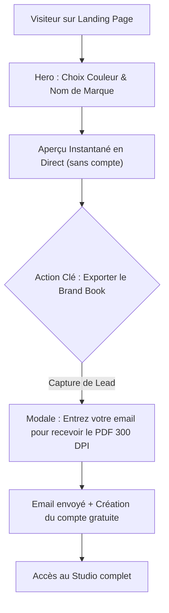

# 🎨 Audit Expert UI/UX, SEO, Marketing Digital & Accessibilité — BrandForge Studio

> **Date :** 5 octobre 2026  
> **Auditeur :** Expert Senior UI/UX · Lead QA / Testeur · Expert SEO Technique · Stratège Marketing Digital  
> **Cible :** Frontend BrandForge Studio (Next.js 16, React 19, Tailwind CSS v4, Framer Motion)  
> **Verdict synthétique :** L'emballage visuel est impressionnant (glassmorphism maîtrisé, animations fluides), mais le produit souffre de **ruptures critiques d'expérience utilisateur (UX)**, d'un **SEO technique sévèrement pénalisé**, de **promesses marketing factices** qui détruisent la confiance, et d'une **accessibilité (a11y) défaillante**.

---

## 📊 Tableau de Bord & Notes de l'Audit

| Pilier Analysé | Note / 10 | Statut | Synthèse |
|---|:---:|:---:|---|
| 🎨 **Design Visuel & Direction Artistique** | **8.5 / 10** | 🟢 Fort | Palette sombre élégante, gradients soignés, micro-interactions bien pensées. |
| 🧭 **Architecture de l'Information & UX** | **4.5 / 10** | 🟠 Fragile | Répétition de sections, tunnel de conversion désorientant, 7 CTAs identiques. |
| 📱 **Responsive & Ergonomie Mobile** | **3.5 / 10** | 🔴 Critique | Le studio est inutilisable sur mobile/tablette (< 1024px), pas de menu burger. |
| ♿ **Accessibilité Numérique (WCAG 2.2)** | **3.0 / 10** | 🔴 Critique | Manque de rôles ARIA, modals non piégées, contrastes insuffisants sur petits textes. |
| 🔍 **SEO Technique & Référencement** | **2.0 / 10** | 🔴 Urgent | `"use client"` sur la racine, métadonnées Next.js par défaut, `lang="en"` sur du FR. |
| 📣 **Marketing Digital & Taux de Conversion** | **4.0 / 10** | 🟠 Trompeur | Faux compteurs / avis inventés, exports qui finissent en `alert()`, aucun lead capture. |
| 🧪 **Qualité de Code & Testabilité (QA)** | **3.5 / 10** | 🔴 Fragile | Composant Canvas monolithique (527 lignes), typages `any`, calculs non debouncés. |

---

## 🔍 ANALYSE DÉTAILLÉE PAR COMPOSANT & ÉCRAN

---

### 1. Structure Globale & Layout (`layout.tsx`, `globals.css`)

#### 🔴 SEO & Conformité : Langue et Métadonnées
- **Fichier :** `src/app/layout.tsx` (L15-28)
  - `lang="en"` est défini alors que l'intégralité du site, des briefs et des mockups est rédigée en français. Google et les lecteurs d'écran considèrent le document comme anglophone.
  - La balise `metadata` est restée sur les valeurs par défaut du générateur :
    ```tsx
    export const metadata: Metadata = {
      title: "Create Next App",
      description: "Generated by create next app",
    };
    ```
    *Impact :* C'est le titre affiché dans les onglets, les partages WhatsApp/Slack/LinkedIn et les SERP Google.

#### 🟠 Typage cassé dans le Layout
- `export default function RootLayout({ children }: LayoutProps<"/">)` : `LayoutProps` n'est ni importé ni standard dans ce contexte Next.js sans générer de warning/erreur TypeScript. Utiliser le standard `{ children: React.ReactNode }`.

#### 🟡 Accessibilité & Navigation Clavier
- Absence d'un lien d'évitement (**Skip to Content**) au tout début du `body` pour permettre aux utilisateurs naviguant au clavier ou sous lecteur d'écran de passer la barre de navigation.

---

### 2. Page d'Accueil (`page.tsx`)

#### 🔴 Le péché originel du SEO : `"use client"` au niveau racine
- **Fichier :** `src/app/page.tsx` (L1)
  - Toute la page marketing est marquée `"use client"`.
  - **Conséquence :** Next.js ne fait aucun pré-rendu serveur (SSG/SSR) du contenu textuel clé (FAQ, processus, arguments de vente). Googlebot et les crawlers reçoivent un HTML quasi vide et doivent exécuter du JavaScript pour lire vos textes. Vos Core Web Vitals (LCP, FCP, TTFB) sont lourdement pénalisées.
  - **Correction :** `page.tsx` doit être un **Server Component**. Seuls les composants ayant un état interactif (`HeroStudio`, `LiveStudioPreview`, `FloatingActionBar`, `FaqSection`) doivent porter `"use client"`.

#### 🟠 La cannibalisation par les CTAs (Call-to-Action)
- On compte **7 boutons d'action** distincts sur la page qui mènent tous sans distinction vers `/studio` :
  1. Navbar : "Mes Projets" (`/studio`)
  2. Navbar : "Ouvrir le Studio" (`/studio`)
  3. Hero : "Générer Mon Brand Book Maintenant" (`/studio`)
  4. Processus : "Tester cette étape en direct" (`/studio`)
  5. Tableau ROI : "Tester BrandForge Immédiatement" (`/studio`)
  6. Bannière finale : "Lancer Mon Brand Book Maintenant" (`/studio`)
  7. Barre flottante : "Créer ma Charte Maintenant" (`/studio`)
- **Problème UX/Marketing :** Trop d'injonctions identiques dispersent l'attention. L'utilisateur qui remplit la dropzone et le brief dans le Hero s'attend à ce que le clic sur "Générer" lance l'analyse de son logo, or il est brutalement redirigé vers un tableau de bord vide.

---

### 3. Barre de Navigation (`Navbar.tsx`)

#### 🟡 Liens d'ancrage morts ou cassés
- Les liens du menu de navigation pointent vers des ancres internes :
  - `#process` (existe dans `ProcessSection.tsx`)
  - `#features` (existe dans `LiveStudioPreview.tsx`)
  - `#mockups` (❌ **Introuvable** — aucun élément ne porte `id="mockups"`, c'est un sous-onglet dans la démo)
  - `#security` (❌ **Introuvable** — aucun élément ne porte `id="security"`)
- Cliquer sur "Mockups 4K" ou "Normes OWASP" ne provoque aucun défilement.

#### 🔴 Absence totale de menu Mobile (Hamburger)
- La navigation principale est masquée avec `hidden lg:flex`.
- Sur un écran inférieur à 1024px (tous les smartphones et tablettes en portrait), les utilisateurs n'ont **aucun moyen de naviguer**, d'accéder au processus ou à la FAQ. Il n'y a aucun menu tiroir (drawer/sheet).

---

### 4. Zone Hero & Dépôt de Logo (`HeroStudio.tsx`)

#### 🔴 Dropzone factice et absence d'input fichier réel
- Le texte annonce : `"Glissez votre logo ici ou parcourez"`, avec "parcourez" stylisé comme un lien souligné.
- **En réalité :**
  - Il n'y a **aucun élément `<input type="file">`** caché.
  - Cliquer sur la dropzone ne déclenche rien du tout (pas d'ouverture du sélecteur de fichiers de l'OS).
  - Seul le drag & drop fonctionne, mais sans contrôle de type MIME ni limite de taille (l'application accepte un fichier `.exe` ou `.mp4` sans broncher).

#### 🟠 Typographie disproportionnée sur petits écrans
- `text-5xl sm:text-7xl md:text-8xl lg:text-9xl font-black` :
  - Sur un iPhone standard (375px - 390px), un texte en `text-5xl` avec des mots longs comme "Ultra-Réaliste" provoque des césures disgracieuses et fait occuper au titre plus de 70% de la hauteur visible avant la ligne de flottaison.

#### 🟡 Promesse technique non vérifiable
- Mention : `"Assainissement XML anti-XSS instantané • Fichier protégé"`.
- Côté client, aucun assainisseur (DOMPurify, regex SVG) n'est exécuté ; c'est un simple badge rassurant mais trompeur pour l'instant.

---

### 5. Démonstrateur Interactif (`LiveStudioPreview.tsx`)

#### 🔴 Données asynchrones déconnectées
- L'utilisateur peut changer la couleur maîtresse (`primaryHex`) avec le sélecteur natif.
- Cependant, les cartes des couleurs **Secondaire** et **Accent** affichent des valeurs CMJN, RVB et Pantone complètement **codées en dur** :
  ```tsx
  // L230 : RVB et CMJN statiques pour la secondaire
  <span>13, 148, 136</span>
  <span>C91 M0 Y8 K42</span>
  ```
  Si l'utilisateur sélectionne un orange vif en couleur maîtresse, la couleur complémentaire affichée ne s'adapte pas mathématiquement (pas de roue chromatique ou triade dynamique calculée).

#### 🟠 Performance : Absence de Debounce sur le Color Picker
- `onChange={(e) => setPrimaryHex(e.target.value)}` s'exécute à chaque micro-mouvement de la souris dans la palette de couleurs de l'OS (jusqu'à 60 fois par seconde), recalculant le contraste WCAG, la luminance et les conversions CMJN sans `useTransition` ni `useDeferredValue`.

#### 🔴 Le dark pattern du "Rendu 4K"
- L'onglet "Mockups 4K Photoréalistes" affiche un faux conteneur de mockup avec un bouton `"Télécharger le Rendu 4K"`.
- Cliquer dessus déclenche :
  ```tsx
  onClick={() => alert("Téléchargement du mockup 4K haute résolution...")}
  ```
  Sur le plan de l'expérience utilisateur et de la crédibilité de marque, un utilisateur testant l'outil ressent une déception immédiate ("c'est juste une démo bidon").

---

### 6. Tableau Comparatif & Chiffres Clés (`RoiComparisonSection.tsx`)

#### 🔴 Risque Légal & Perte de Crédibilité (Social Proof)
- Le composant met en avant :
  - `+18 450 Chartes Graphiques Créées`
  - `4.9 / 5 (+1 200 avis vérifiés)`
- **Avis d'expert Marketing :** Utiliser de faux chiffres aussi précis et la mention "avis vérifiés" sur un projet naissant sans base utilisateurs active constitue une pratique commerciale trompeuse (directive européenne Omnibus / code de la consommation).
- **Alternative valorisante :** Parler de *"Génération instantanée en 60s"*, *"0 € de coût de licence"*, *"Format vectoriel 300 DPI certifié"* sans s'inventer une masse critique d'utilisateurs.

---

### 7. Foire Aux Questions (`FaqSection.tsx`)

#### 🔴 Non-conformité Accessibilité (WCAG 2.2 Niveau A)
- Les accordéons sont codés avec un simple `<button>` et un `div` conditionnel `{isOpen && (...) }`.
- **Manques critiques pour les lecteurs d'écran :**
  - Pas d'attribut `aria-expanded={isOpen}` sur le bouton.
  - Pas de liaison `aria-controls="faq-answer-1"` entre la question et la réponse.
  - Pas d'`id` ni de `role="region"` sur la réponse dépliée.
  - L'animation d'ouverture manque d'une transition fluide de hauteur (`grid-template-rows` ou `framer-motion`).

---

### 8. Tableau de Bord Studio (`/studio/page.tsx`)

#### 🔴 Ergonomie Mobile Désastreuse
- Le dashboard utilise `<StudioSidebar />` qui est configuré en `w-64 fixed/sticky h-screen`.
- Sur smartphone (largeur < 768px) :
  - La sidebar mange **60 à 70% de la largeur de l'écran**, rendant le contenu principal quasi illisible ou provoquant un scroll horizontal incontrôlé.
  - Il n'y a pas de breakpoint `hidden md:flex` avec tiroir rétractable.

#### 🟠 Génération d'identifiant de projet non fiable
- **Fichier :** `src/app/studio/page.tsx` (L18)
  ```tsx
  id: (newProj.title || "nouveau-projet").toLowerCase().replace(/\s+/g, "-")
  ```
  Si l'utilisateur crée deux projets intitulés "Test", ils ont le même `id`, ce qui casse les clés React (`key={project.id}`) et rend le routage `/studio/test` ambigu. Remplacer impérativement par `crypto.randomUUID()`.

---

### 9. Espace de Création Studio (`/studio/[projectId]/page.tsx`)

#### 🔴 Le piège de l'écran scindé sur petit écran
- Le layout imbrique :
  - Un volet gauche `ChatCopilot` (`w-80 md:w-96`, soit ~384px)
  - Un espace central `BrandCanvas`
- Sur tout écran en dessous de 1280px, le canvas est compressé dans un carré minuscule où les textes de la charte graphique deviennent illisibles.
- **Recommandation UX :** Mettre en place un système d'onglets ou un panneau pliable (collapsible drawer) pour le Copilote IA sur écran réduit.

#### 🔴 Le composant géant `BrandCanvas.tsx` (527 lignes)
- Ce fichier contient dans un unique composant le code de rendu de 7 pages de charte différentes (`COVER`, `MANIFESTO`, `LOGO_PRIMARY`, `COLOR_PALETTE`, `TYPOGRAPHY`, `MOCKUP_HERO`, `DO_AND_DONTS`).
- **Impacts :**
  - Toute modification sur la page de couverture re-calcule et ré-évalue le JSX des 6 autres pages.
  - Impossible de tester unitairement la page typographie ou la page logo.
  - Viol du principe de responsabilité unique (SRP).

#### 🟠 Modal de création de projet (`CreateProjectModal.tsx`)
- La modale est un simple `div` centré :
  - La touche **Échap (Escape)** ne ferme pas la modale.
  - Le clic à l'extérieur (sur le backdrop) ne ferme pas la modale.
  - Le focus clavier n'est pas capturé (**focus trap manquant**) : appuyer sur `Tab` permet d'aller sélectionner des boutons cachés derrière la modale dans le dashboard.

---

## ♿ MATRICE DE CONFORMITÉ ACCESSIBILITÉ (WCAG 2.2)

Le projet met en avant la conformité **WCAG 2.2 AAA** pour ses palettes de couleurs, mais le site lui-même présente des défauts fondamentaux :

| Règle WCAG | Intitulé | Statut | Problème identifié sur le site |
|---|---|:---:|---|
| **1.3.1 (A)** | Info and Relationships | ❌ Échec | `<input type="color">` sans balise `<label>` associée ni `aria-label`. |
| **1.4.3 (AA)** | Contrast (Minimum) | ⚠️ Limite | Les textes secondaires en `text-zinc-500` (#71717A) sur fond `#070709` ont un ratio de contraste de ~2.9:1 (en dessous des 4.5:1 requis). |
| **1.4.8 (AAA)** | Visual Presentation | ❌ Échec | Présence abondante de textes en `text-[9px]` et `text-[10px]` illisibles sans zoom important. |
| **2.1.1 (A)** | Keyboard Navigation | ❌ Échec | Dropzone de logo inaccessible au clavier ; modale sans focus trap. |
| **2.4.1 (A)** | Bypass Blocks | ❌ Échec | Aucun lien d'évitement ("Passer au contenu principal"). |
| **2.4.3 (A)** | Focus Order | ❌ Échec | La modal ne capture pas le focus et ne le restitue pas à la fermeture. |
| **4.1.2 (A)** | Name, Role, Value | ❌ Échec | Boutons de zoom et pagination sans `aria-label` descriptif ; accordéons sans `aria-expanded`. |

---

## 🎯 STRATÉGIE MARKETING DIGITAL & CONVERSION (CRO)

### Le Problème du Tunnel de Vente Actuel
Actuellement, le parcours utilisateur est une voie sans issue :
1. L'utilisateur arrive sur une landing page qui promet monts et merveilles.
2. Il clique sur un bouton de test.
3. Il atterrit sur un dashboard pré-rempli avec des données fictives ("Lumina Botanica").
4. Il clique sur exporter : une popup JavaScript `alert()` apparaît.
5. **Résultat :** Zéro inscription, zéro adresse email collectée, zéro intention d'achat enregistrée.

### Nouveau Tunnel Recommandé pour la Phase 1 (MVP)



---

## 📋 PLAN DE CORRECTION PRIORISÉ (ROADMAP UX/FRONTEND)

Voici les chantiers découpés par ordre d'urgence et d'impact :

### 🔴 Phase 1 : Urgences Fondamentales & SEO (1 à 2 jours)
- [ ] **1.1** Transformer `src/app/page.tsx` en Server Component (retirer `"use client"` de la page racine).
- [ ] **1.2** Configurer des métadonnées professionnelles et le bon OpenGraph dans `layout.tsx`, passer `lang="fr"`.
- [ ] **1.3** Réparer ou remplacer les ancres brisées du menu de navigation (`#features`, `#process`).
- [ ] **1.4** Corriger les mentions marketing trompeuses (remplacer les faux 18 000 avis par un positionnement "Accès Bêta Ouvert").
- [ ] **1.5** Supprimer le typage `LayoutProps` erroné dans `layout.tsx`.

### 🟡 Phase 2 : Rendre l'Expérience Vivante & Fonctionnelle (3 à 5 jours)
- [ ] **2.1** Rendre la dropzone du Hero 100% fonctionnelle avec un vrai sélecteur de fichier (`<input type="file" accept=".svg,.png">`) et une vraie prévisualisation du logo déposé.
- [ ] **2.2** Rendre les couleurs secondaires et d'accent du démonstrateur dynamiques (calculées en fonction de la couleur primaire).
- [ ] **2.3** Remplacer les fausses alertes d'export par un téléchargement réel (ex: génération d'une feuille de style de tokens JSON ou SVG vectoriel de la palette).
- [ ] **2.4** Corriger le bug des identifiants dans la création de projet avec `crypto.randomUUID()`.
- [ ] **2.5** Remplacer le badge "Connecté Gemini 2.5" du chat par "Assistant Créatif (Mode Démo)" tant que l'API n'est pas branchée.

### 🟢 Phase 3 : Accessibilité & Ergonomie Mobile (3 à 4 jours)
- [ ] **3.1** Créer un menu mobile (Drawer responsive) pour la Navbar sur les écrans < 1024px.
- [ ] **3.2** Rendre la Sidebar et le ChatCopilot du Studio repliables ou convertibles en onglets mobiles.
- [ ] **3.3** Implémenter les attributs ARIA complets sur les accordéons FAQ (`aria-expanded`, `aria-controls`).
- [ ] **3.4** Sécuriser la modale de création de projet (fermeture Échap, clic backdrop, focus trap).
- [ ] **3.5** Ajouter des `aria-label` sur tous les boutons avec icône seule (zoom, pagination, export).

### 🔵 Phase 4 : Refactorisation Propre du Code (3 jours)
- [ ] **4.1** Découper `BrandCanvas.tsx` en sous-composants dédiés :
  - `CoverPage.tsx`
  - `ManifestoPage.tsx`
  - `LogoGuidelinesPage.tsx`
  - `ColorPalettePage.tsx`
  - `TypographyPage.tsx`
  - `MockupPreviewPage.tsx`
  - `DoAndDontsPage.tsx`
- [ ] **4.2** Supprimer tous les types `any` résiduels (notamment dans `ProcessSection.tsx`).
- [ ] **4.3** Débouncer le sélecteur de couleur avec `useDeferredValue`.
- [ ] **4.4** Créer les pages standard Next.js : `loading.tsx`, `error.tsx` et `not-found.tsx`.

---

## 💡 Message Final d'Orientation

> Tu as déjà fait la partie la plus difficile sur le plan créatif : **donner une vraie âme visuelle et une identité haut de gamme à BrandForge**. L'ambiance sombre, les reflets de verre et le rythme de la landing page rivalisent avec les meilleurs templates SaaS du marché.
>
> Maintenant, il faut que l'expérience soit **honnête, fluide et fonctionnelle**. En suivant ce plan d'action étape par étape, on va transformer cette superbe vitrine en un produit solide, accessible et prêt à convertir de vrais utilisateurs.
