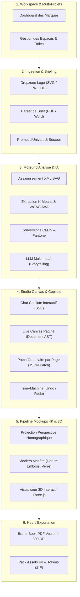
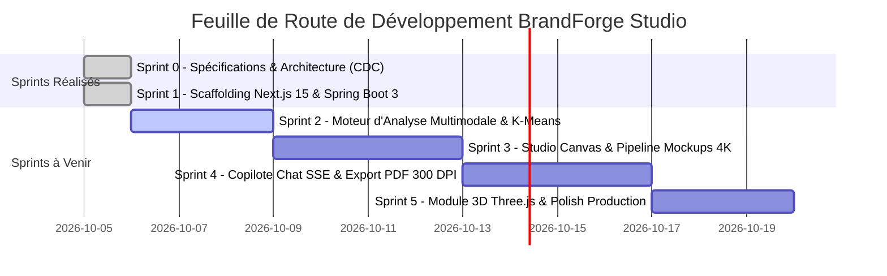

# Cahier des Charges Fonctionnel & Technique Intégral (CDC)
# BrandForge Studio (Ultra Edition)

> **Document de Référence Maître**  
> Version : **3.0 (Master Production Edition)**  
> Date de révision : **05 Octobre 2026**  
> Statut : **En cours d'exécution active (Sprint 1 validé avec succès)**  

---

## 1. Vision Stratégique & Positionnement Produit

### 1.1 Contexte & Problématique
La création d'une charte graphique professionnelle complète (Brand Book) exige habituellement entre 10 et 30 jours de travail d'un studio de design pour un coût oscillant entre **800 € et 5 000 €+**. 
Les générateurs actuels (Looka, Canva, Brandmark) se cantonnent à des gabarits statiques et génériques, sans véritable compréhension narrative de l'univers de marque et sans fournir de mockups haute fidélité adaptés au métier du client.

### 1.2 La Vision « Creative Brand OS »
**BrandForge Studio** est conçu non pas comme un simple formulaire de génération, mais comme un **Studio de Direction Artistique Virtuelle et un Système d'Exploitation Créatif (Brand OS)** (à l'intersection de Figma, Cursor et v0.dev, appliqué à l'identité de marque) :
* **Adaptabilité Totale & Ouverte** : Capacité à décoder n'importe quel univers de marque (haute horlogerie, cosmétique bio, aérospatiale, bistronomie, fintech, etc.) sans limitation à des catégories préconçues.
* **Mockups 4K Photoréalistes de Studio** : Rendu ultra-net préservant l'intégrité vectorielle du logo (sans distorsion, bavure ou hallucination d'IA générative), avec gestion physique des matières (dorure à chaud, embossage, textile brodé, verre dépoli).
* **Copilote IA Conversationnel & Ingestion de Briefs (RAG)** : Possibilité de dialoguer avec l'IA et d'importer des documents lourds (PDF, DOCX) pour affiner la direction artistique.
* **Édition Granulaire en Direct par Prompts (Document AST)** : Possibilité de modifier en direct soit une page spécifique du Brand Book sans recalculer le reste, soit la charte entière en cascade.
* **Zéro Frais Récurrents (0 €)** : Architecture pensée exclusivement sur des technologies Open Source et des paliers gratuits (*Free Tiers*) pérennes.

---

## 2. Architecture Technique Découplée

Pour allier une interface utilisateur spectaculaire (animations 60 FPS, WebGL 3D) à une sécurité de niveau bancaire et une grande robustesse transactionnelle, l'application est découpée en deux environnements indépendants :

```
┌─────────────────────────────────────────────────────────────────────────────┐
│                    MODULE FRONTEND : NEXT.JS 15 (REACT 19)                  │
│                                                                             │
│  • Framework : Next.js 15 (Turbopack, App Router, Server/Client Components) │
│  • Design & Style : Tailwind CSS v4 + Design System Studio Sombre           │
│  • Animations : Framer Motion (Ressorts physiques à 60 FPS constants)      │
│  • Rendu 3D : Three.js + React Three Fiber (WebGL dans le navigateur)       │
│  • Moteur de Rendu PDF : @react-pdf/renderer (Vectoriel natif 300 DPI)     │
└──────────────────────────────────────┬──────────────────────────────────────┘
                                       │
                       Requêtes REST Sécurisées (JSON)
                       Streaming Temps Réel (Server-Sent Events - SSE)
                       En-tête : Authorization: Bearer <JWT>
                                       │
┌──────────────────────────────────────▼──────────────────────────────────────┐
│                  MODULE BACKEND : SPRING BOOT 3 (JAVA 21 LTS)               │
│                                                                             │
│  • Moteur Core : Spring Boot 3.3.4 + Java 21 (Virtual Threads Loom)        │
│  • Sécurité & Contrôle d'Accès : Spring Security 6 + JJWT 0.12 (Argon2id)   │
│  • Persistance Données : Spring Data JPA / Hibernate sur PostgreSQL 16      │
│  • Orchestration IA : Masquage étanche clé Gemini API / Client Ollama local │
│  • Parsing de Documents : Apache PDFBox (PDF) & Apache POI (Word .docx)     │
│  • Pipeline Graphique : TwelveMonkeys ImageIO, K-Means & Validation XML SVG │
└───────────────────────┬─────────────────────────────┬───────────────────────┘
                        │                             │
            ┌───────────▼───────────┐     ┌───────────▼───────────┐
            │ PostgreSQL (Supabase) │     │ Cloudflare R2 / MinIO │
            │ Tables relationnelles │     │ Stockage Assets & 4K  │
            └───────────────────────┘     └───────────────────────┘
```

---

## 3. Périmètre Fonctionnel Complet (Matrice des Modules)



### 3.1 Module 1 : Espace Multi-Projets & Workspace
* **Dashboard Central** : Vue d'ensemble de toutes les chartes graphiques de l'utilisateur, avec cartes de prévisualisation, étiquettes de secteur, date de mise à jour et statut.
* **Isolation Multi-Tenancy** : Chaque projet est strictement isolé par son propriétaire via Spring Security (aucun utilisateur ne peut requêter ou modifier les actifs d'un autre).
* **Gestion des Rôles (RBAC)** :
  * `ADMIN` : Accès aux paramètres système, quotas et métriques de santé (`/actuator`).
  * `CREATOR` : Droit complet de création, modification par prompt et export.
  * `CLIENT_VIEWER` : Droit de consultation en lecture seule sur le Brand Portal en ligne.

### 3.2 Module 2 : Ingestion Multimodale Sécurisée
* **Dropzone Intelligente** :
  * Glisser-déposer de logos vectoriels (`.svg`) ou matriciels (`.png`, `.webp`, `.jpg`).
  * Vérification binaire par *Magic Bytes* pour bloquer les faux fichiers déguisés.
  * Limite maximale de taille : **25 Mo**.
* **Ingestion de Briefs & Contexte Riche** :
  * Champ de saisie d'univers avec suggestions contextuelles dynamiques.
  * Téléversement de documents de brief complets au format `.pdf` ou `.docx` : le backend en extrait le texte brut via Apache PDFBox / POI pour nourrir la mémoire créative du copilote.

### 3.3 Module 3 : Moteur d'Analyse Visuelle, Chromatique & Storytelling
* **Assainissement XML Strict du Logo** :
  * Neutralisation impérative de toute balise `<script>`, gestionnaire d'événement (`onload`, `onclick`) ou entité externe DTD afin d'éradiquer les failles XSS et XXE.
* **Moteur Colorimétrique Certifié** :
  * Extraction des couleurs dominantes par clustering K-Means.
  * Calcul mathématique de luminance relative et ratios de contraste conformes aux normes **WCAG 2.2 niveau AA ($\ge 4.5:1$) et AAA ($\ge 7:1$)**.
  * Conversion dynamique vers les 4 espaces universels : **HEX**, **sRGB**, **CMJN Print (FOGRA39 / ISO Coated)** et référence **Pantone Solid Coated** la plus proche.
* **Storytelling & Identité de Marque** :
  * Analyse conjointe du logo et du brief par l'IA (Gemini Multimodal ou Ollama local).
  * Génération structurée en JSON : Mission, Vision, 4 Valeurs clés, Archétype de marque jungien et Guide de Ton de Voix (*Tone of Voice*).

### 3.4 Module 4 : Système de Logo & Déclinaisons
* **Variantes Vectorielles Automatiques** :
  * Version Originale (Pleine couleur).
  * Version Monochrome Noir (`#000000`) sur fond transparent.
  * Version Monochrome Blanc (`#FFFFFF`) pour marquage laser ou fond contrasté.
  * Version Favicon / Monogramme centré avec marge de sécurité.
* **Directives d'Utilisation** :
  * Calcul mathématique de la zone d'exclusion (*clear space*) basée sur un ratio $0.5X$ du symbole.
  * Règles visuelles de **Do & Don'ts** (interdiction d'anamorphose/déformation, de rotation arbitraire ou de modification des teintes officielles).

### 3.5 Module 5 : Copilote Conversationnel & Live Canvas (Document AST)
* **Chat Copilote Interactif** :
  * Volet latéral permettant de converser avec le directeur artistique virtuel.
  * Streaming mot par mot de ses explications et propositions créatives via Server-Sent Events (SSE).
* **Document AST (Arbre de Pages Granulaire)** :
  * Le Brand Book est modélisé sous la forme d'un arbre d'objets JSON (`BrandPage`).
  * **Prompts Granulaires** : L'utilisateur peut cibler une consigne sur une page précise (ex. : *"Sur la page 4, change le mockup pour un flacon de parfum"*). L'IA émet un **patch JSON (RFC 6902)** et seule la page 4 s'anime et se régénère sans toucher aux autres.
  * **Prompts Globaux** : L'utilisateur peut ordonner une consigne générale (ex. : *"Passe la couleur secondaire en vert émeraude"*), répercutée en cascade sur tous les tokens de la charte.
* **Virtualisation de Canvas 60 FPS** :
  * Seules les pages visibles dans le viewport chargent le rendu haute résolution (Intersection Observer), garantissant un défilement ultra-fluide sans saturer la mémoire du navigateur.
* **Time-Machine (Historique & Undo/Redo)** :
  * Chaque modification par prompt crée un point de restauration immuable permettant de revenir en arrière instantanément (`Ctrl+Z`).

### 3.6 Module 6 : Pipeline de Mockups 4K Photoréalistes & 3D
* **Composition Hybride Haute Définition** :
  * Application du logo vectoriel par **projection homographique 3D** (transformation perspective mathématique sans pixelisation ni bavure).
  * **Shaders Physiques de Matière** :
    * *Dorure à chaud (Gold/Silver Foil)* avec reflets spéculaires.
    * *Embossage / Débossage* en creux sur papier coton texturé 600g.
    * *Sérigraphie et broderie* sur textile (t-shirt, tote-bag, tablier).
    * *Verre dépoli et réfraction* pour flacons et enseignes rétroéclairées.
  * Rendu téléchargeable en résolution native **4K UHD (3840 x 2160 px, 300 DPI)**.
* **Visualiseur 3D Interactif (Three.js / WebGL)** :
  * Intégration dans le navigateur permettant de faire pivoter le packaging ou la carte de visite à 360° sous un éclairage studio dynamique.
  * Préparation de la roadmap pour l'export en vidéo cinématique courte (MP4 / WebM).

### 3.7 Module 7 : Hub d'Exportation & Livrables Studio
1. **Brand Book PDF Print-Ready 300 DPI** :
   * Compilation multipages vectorielle via `@react-pdf/renderer`.
   * Textes et logos vectoriels nets à 800% de zoom.
   * Planches de conformité d'impression avec métriques CMJN et Pantone.
2. **Pack d'Assets Téléchargeable (Archive ZIP)** :
   * Logos déclinés aux formats SVG et PNG 4K transparents.
   * Renders 4K des mockups en pleine définition.
   * Fichier `design-tokens.json` et configuration Tailwind pour les développeurs.

---

## 4. Modèle de Données & Schéma Relationnel (PostgreSQL)

```
                               ┌───────────────────────────┐
                               │           USERS           │
                               ├───────────────────────────┤
                               │ id : UUID (PK)            │
                               │ email : VARCHAR (UNIQUE)  │
                               │ password : VARCHAR (HASH) │
                               │ name : VARCHAR            │
                               │ role : VARCHAR (CREATOR)  │
                               │ created_at : TIMESTAMP    │
                               └─────────────┬─────────────┘
                                             │ 1
                                             │
                                             │ N
                               ┌─────────────▼─────────────┐
                               │         PROJECTS          │
                               ├───────────────────────────┤
                               │ id : UUID (PK)            │
                               │ owner_id : UUID (FK)      │
                               │ title : VARCHAR           │
                               │ industry : VARCHAR        │
                               │ description : TEXT        │
                               │ logo_url : VARCHAR        │
                               │ primary_color_hex : TEXT  │
                               │ secondary_color_hex : TEXT│
                               │ accent_color_hex : TEXT   │
                               │ heading_font : VARCHAR    │
                               │ body_font : VARCHAR       │
                               │ created_at : TIMESTAMP    │
                               └─────────────┬─────────────┘
                                             │ 1
                                             │
                                             │ N
                               ┌─────────────▼─────────────┐
                               │        BRAND_PAGES        │
                               ├───────────────────────────┤
                               │ id : UUID (PK)            │
                               │ project_id : UUID (FK)    │
                               │ order_index : INT         │
                               │ page_type : VARCHAR       │
                               │ title : VARCHAR           │
                               │ content_json : TEXT (AST) │
                               │ local_overrides : TEXT    │
                               │ created_at : TIMESTAMP    │
                               └───────────────────────────┘
```

---

## 5. Spécifications Non-Fonctionnelles & Normes Industrielles

### 5.1 Performance & Fluidité (Budgets Core Web Vitals)
* **Temps de Réponse Perçu** : Feedback visuel à toute interaction utilisateur en **$< 50\text{ ms}$**.
* **Framerate d'Animation** : **60 FPS constants** garantis par la physique de ressorts de Framer Motion.
* **Cumulative Layout Shift (CLS)** : $= 0.00$ grâce à la réservation stricte d'espace et aux squelettes de chargement dimensionnés.

### 5.2 Sécurité & Durcissement (OWASP 2026)
* **Authentification** : Mots de passe chiffrés avec **Argon2id / BCrypt**, tokens JWT signés en HMAC-SHA256 (expiration 15 min avec rafraîchissement sécurisé).
* **Assainissement des Fichiers** : Détection binaire par Magic Bytes + assainissement XML pour éradiquer tout script injecté dans les logos SVG.
* **Protection Anti-IDOR** : Isolation stricte de chaque projet au niveau du service Spring Boot (`findByIdAndOwner`).
* **Conformité RGPD** : Droit à l'oubli intégral en un clic, aucune exploitation des données clients pour l'entraînement d'IA publiques.

---

## 6. La Stack 100% Gratuite (0 € de Coût de Licence)

| Couche | Outil / Service | Licence / Quota Gratuit | Rôle |
| :--- | :--- | :--- | :--- |
| **Frontend** | **Next.js 15 (React 19)** | MIT (Gratuit) | Interface Studio, Canvas paginé, SSR/SSG. |
| **Styling & UI** | **Tailwind CSS v4 + shadcn** | MIT (Gratuit) | Thème sombre Studio, grille 8pt, tokens OKLCH. |
| **Animations** | **Framer Motion** | MIT (Gratuit) | Micro-interactions et transitions 60 FPS. |
| **3D Temps Réel** | **Three.js + React Three Fiber**| MIT (Gratuit) | Visualiseur d'objets 3D dans le navigateur. |
| **Backend Core** | **Spring Boot 3 + Java 21** | Apache 2.0 (Gratuit) | Logique métier, sécurité d'entreprise, API REST. |
| **Sécurité Backend**| **Spring Security 6 + JJWT** | Apache 2.0 (Gratuit) | Filtres d'authentification et gestion des rôles. |
| **Persistance** | **Spring Data JPA + PostgreSQL**| PostgreSQL Free (0 €)| Transactions relationnelles ACID et stockage de l'AST. |
| **Moteur d'IA** | **Google AI Studio (Gemini)** | **0 € (Free Tier)** | 15 req/min & 1 500 req/jour gratuites (Vision + LLM). |
| **Stockage 4K** | **Cloudflare R2** | **0 € (10 Go gratuits)** | Stockage fichiers et **0 € de frais de bande passante (Egress)**. |
| **Export PDF** | **@react-pdf/renderer** | MIT (Gratuit) | Rendu vectoriel natif 300 DPI sans licence Adobe. |

---

## 7. Roadmap d'Exécution & État d'Avancement Réel



### Journal d'Exécution :
* ✅ **Sprint 0 (Terminé)** : Rédaction des spécifications d'excellence, définition de la Clean Architecture, de l'AST de marque et des règles de sécurité OWASP.
* ✅ **Sprint 1 (Terminé & Validé)** :
  * **Frontend Next.js 15** : Configuré avec Turbopack, Tailwind CSS v4, Framer Motion, Navbar Studio, Hero avec Dropzone interactive et composant de prévisualisation en direct avec calcul mathématique des contrastes WCAG AAA. Compilation de production : **100% Réussie (`npm run build` OK)**.
  * **Backend Spring Boot 3 (Java 21)** : Scaffolding Maven complet, Spring Security 6 avec filtres JWT, configuration CORS pour Next.js, entités JPA `User`, `Project`, `BrandPage`, repositories et contrôleurs REST d'authentification et de projets. Compilation Java 21 : **100% Réussie (`BUILD SUCCESS` OK)**.
* ⏳ **Sprint 2 (Prochaine étape)** : Moteur d'extraction K-Means sur le logo, assainissement XML SVG et intégration du client d'API multimodale pour le storytelling de marque.
