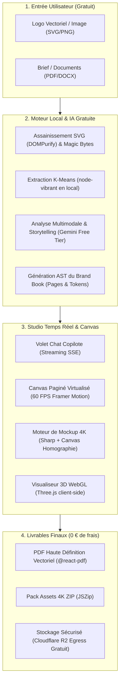

# Guide Complet de la Stack 100% Gratuite & Architecture Solide
## BrandForge Studio (Ultra Edition)

> **Objectif Zéro Coût (0 €)** : Tous les outils, bibliothèques, services d'IA, moteurs graphiques et solutions d'hébergement listés ici sont soit **Open Source (licence MIT/Apache/BSD)**, soit disposent d'un **palier gratuit (Free Tier) généreux et pérenne**, sans carte bancaire obligatoire pour développer et lancer l'application en production.

---

## 1. La Stack Complète « Zéro Euro » (Outils & Librairies)

### 1.1 Frontend & Interface Utilisateur (100% Open Source)

| Rôle | Outil / Librairie | Licence / Coût | Pourquoi ce choix ? |
| :--- | :--- | :--- | :--- |
| **Framework Core** | **Next.js 15 (App Router, Turbopack)** | MIT (Gratuit) | Rendu hybride (SSR, RSC, Server Actions), routage ultra-rapide. |
| **Langage** | **TypeScript 5.6+** | Apache 2.0 (Gratuit) | Typage strict pour éviter 99% des bugs d'exécution en prod. |
| **Moteur CSS** | **Tailwind CSS v4** | MIT (Gratuit) | Styling moderne sans fichier CSS lourd, compilation instantanée. |
| **Composants UI** | **shadcn/ui + Radix UI** | MIT (Gratuit) | Composants accessibles (WCAG), code source copié dans votre projet (zéro dépendance externe fermée). |
| **Animations 60 FPS** | **Framer Motion** | MIT (Gratuit) | Transitions fluides, ressorts naturels (*spring physics*), respect du `prefers-reduced-motion`. |
| **Pack d'Icônes** | **Lucide React** | ISC (Gratuit) | +1 000 icônes modernes, légères, vectorielles et cohérentes. |
| **Sélecteur de Couleur** | **react-colorful** | MIT (Gratuit) | 2.8 Ko, hyper rapide, support HEX, RGB, HSL, sans aucune dépendance. |
| **Typographies Libres** | **Google Fonts (OFL)** | Open Font License | *Plus Jakarta Sans*, *Inter*, *Cabinet Grotesk*, *Geist Mono* (100% libres pour usage commercial). |

---

### 1.2 Moteur d'IA & Analyse Multimodale (Free Tier & Local)

| Rôle | Solution Retenue | Coût / Quota Gratuit |
| :--- | :--- | :--- |
| **Moteur Cloud Principal** | **Google AI Studio (Gemini 2.5 / 1.5 Flash)** | **0 € (Free Tier très généreux)** : 15 requêtes/minute (RPM) et 1 500 requêtes/jour gratuites. Comprend à la fois l'analyse d'image (Vision) et la génération textuelle structurée (JSON). |
| **Option 100% Locale / Offline** | **Ollama (Llama 3.2 Vision / Mistral)** | **0 € (100% Libre et Illimité)** : S'exécute directement sur votre machine sans passer par Internet ni dépendre d'une API tierce. |

---

### 1.3 Moteur Graphique, Vectoriel & Mockups (100% Open Source & Local)

| Rôle | Librairie / Moteur | Coût | Rôle Technique |
| :--- | :--- | :--- | :--- |
| **Traitement d'Image Serveur** | **Sharp (libvips)** | Apache 2.0 (0 €) | Moteur C/C++ ultra-rapide en Node.js : découpage, redimensionnement 4K, masques d'opacité, conversion WebP/AVIF. |
| **Extraction de Palette** | **node-vibrant** (ou algorithme K-Means natif) | MIT (0 €) | Calcule les couleurs dominantes, la température chromatique et le contraste directement en mémoire. |
| **Vectorisation Automatique** | **Potrace (ou vtracer WASM)** | GPL / MIT (0 €) | Convertit les logos PNG/JPG basse résolution en tracés vectoriels SVG parfaits. |
| **Sécurisation & Anti-XSS SVG** | **DOMPurify + svgo** | Apache / MIT (0 €) | Élimine tout code malveillant des fichiers SVG téléversés et optimise les tracés. |
| **Moteur de Projection 4K** | **HTML5 Canvas API / node-canvas** | MIT (0 €) | Matrice de transformation perspective 2D/3D (homographie) pour plaquer le logo sur les scènes sans déformation vectorielle. |
| **Scène 3D Temps Réel** | **Three.js + React Three Fiber** | MIT (0 €) | Rendu WebGL 3D interactif dans le navigateur client (0 charge pour le serveur). |

---

### 1.4 Ingestion de Briefs & Extraction de Fichiers (100% Open Source)

| Format | Outil d'Extraction | Coût | Usage |
| :--- | :--- | :--- | :--- |
| **Documents PDF** | **pdf-parse** (ou Mozilla pdfjs) | MIT / Apache (0 €) | Extrait le texte des briefs clients importés pour alimenter le copilote. |
| **Documents Word (.docx)** | **mammoth** | BSD (0 €) | Convertit les briefs Word en texte propre sans fioritures. |

---

### 1.5 Moteur d'Export & Livrables (100% Open Source)

| Livrable | Librairie | Coût | Résultat |
| :--- | :--- | :--- | :--- |
| **Brand Book PDF Haute Définition** | **@react-pdf/renderer** | MIT (0 €) | Génère des PDF vectoriels multipages 300 DPI directement avec du code React. Aucune licence Adobe payante requise. |
| **Pack d'Assets Téléchargeable** | **JSZip + FileSaver** | MIT (0 €) | Compile les logos SVG, PNG 4K et tokens de marque dans une archive `.zip` côté client. |

---

### 1.6 Infrastructure, Base de Données & Hébergement (0 €)

| Service | Fournisseur / Outil | Offre Gratuite (Free Tier) |
| :--- | :--- | :--- |
| **Hébergement Frontend & API** | **Vercel** | **0 €** : Déploiement Next.js mondial, SSL automatique, Edge Network. |
| **Base de Données PostgreSQL** | **Supabase** (ou Neon Postgres) | **0 €** : 500 Mo de base PostgreSQL, authentification intégrée, 50 000 utilisateurs actifs. |
| **Stockage Fichiers (Assets & 4K)** | **Cloudflare R2** | **0 €** : **10 Go de stockage gratuit par mois** et surtout **0 € de frais de bande passante sortante (Egress)** (contrairement à AWS S3 qui facture le moindre téléchargement). |
| **Cache & File d'Attente** | **Upstash Redis** | **0 €** : 10 000 commandes/jour gratuites (parfait pour le rate-limiting et les tâches en arrière-plan). |

---

## 2. Architecture Solide des Dossiers (Structure Next.js 15 Pro)

Voici l'arborescence exacte de production mise en place :

```
graphic_chart/
├── README.md                          # Présentation et gouvernance
├── docs/                              # Corpus documentaire de référence
│   ├── ARCHITECTURE.md
│   ├── FREE_STACK_AND_ARCHITECTURE.md
│   ├── STUDIO_WORKSPACE_ENGINE.md
│   ├── UI_UX_DESIGN_SYSTEM.md
│   ├── SECURITY_COMPLIANCE.md
│   ├── SCALABILITY_PERFORMANCE.md
│   ├── ACCEPTANCE_CRITERIA.md
│   └── PROGRESS_TRACKER.md
│
├── public/                            # Assets statiques publics
│   ├── mockups/base/                  # Scènes de base 4K libres de droits
│   └── templates/                     # Gabarits vectoriels de charte
│
├── src/
│   ├── app/                           # Next.js 15 App Router
│   │   ├── layout.tsx                 # Layout global avec polices locales et providers
│   │   ├── page.tsx                   # Landing page cinématique et vitrine
│   │   ├── studio/                    # Espace Studio de création
│   │   │   ├── page.tsx               # Dashboard multi-projets
│   │   │   └── [projectId]/
│   │   │       └── page.tsx           # Studio interactif (Chat + Live Canvas)
│   │   └── api/                       # API Route Handlers
│   │       ├── analyze/route.ts       # Extraction logo K-Means + Gemini Vision
│   │       ├── chat/route.ts          # Copilote interactif (Streaming SSE)
│   │       ├── export/pdf/route.ts    # Compilation PDF 300 DPI
│   │       └── mockups/render/route.ts# Moteur de rendu 4K avec Sharp
│   │
│   ├── components/                    # Composants React modulaires
│   │   ├── ui/                        # Primitives shadcn/ui (Button, Dialog, Slider...)
│   │   ├── landing/                   # Sections de la page d'accueil (Hero, Showcase...)
│   │   ├── studio/                    # Éléments du Studio interactif
│   │   │   ├── ProjectCard.tsx        # Carte projet du dashboard
│   │   │   ├── ChatCopilot.tsx        # Volet de conversation et upload de brief
│   │   │   ├── LiveCanvas.tsx         # Visualiseur paginé virtualisé
│   │   │   ├── PageInspector.tsx      # Panneau d'ajustement granulaire (couleurs, typo)
│   │   │   └── MockupViewer.tsx       # Rendu 4K avec shaders de matière
│   │   └── 3d/                        # Composants Three.js (Turnaround interactif)
│   │       └── ProductScene.tsx       # Scène WebGL avec contrôle orbital
│   │
│   ├── lib/                           # Cœur métier & Logique pure (Domain & Utils)
│   │   ├── color/                     # Calculs colorimétriques (WCAG, CMJN, Pantone)
│   │   ├── image/                     # Traitement d'image Sharp & Canvas projection
│   │   ├── vector/                    # Assainissement SVG (DOMPurify) & Potrace
│   │   ├── ai/                        # Client Gemini structuré & Prompts système
│   │   ├── pdf/                       # Gabarit de document @react-pdf
│   │   └── store/                     # Store Zustand pour l'état du studio
│   │
│   └── types/                         # Interfaces TypeScript strictes
│       ├── brand.ts                   # Schéma de l'AST de marque (tokens, pages)
│       └── project.ts                 # Définition des projets et messages de chat
│
├── .env.example                       # Variables d'environnement documentées
├── tailwind.config.ts                 # Configuration Tailwind avec tokens OKLCH
├── tsconfig.json                      # Configuration TypeScript stricte
└── package.json                       # Dépendances du projet
```

---

## 3. Schéma de Flux : Du Logo Brut au Brand Book 4K


