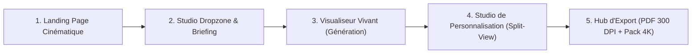

# Guide de Design System, UI/UX & Spécifications d'Animations
## BrandForge Studio (Ultra Edition)

---

## 1. Direction Artistique & Identité Visuelle

L'interface de BrandForge Studio est conçue pour procurer une sensation immédiate d'**excellence, de précision et de raffinement**. Elle s'inspire des standards esthétiques les plus prestigieux du web moderne (*Linear, Apple, Vercel, Teenage Engineering*).

### 1.1 Principes Fondamentaux de Design
* **Dark Mode Studio par Défaut** : Palette de gris profonds, d'ardoise et de noir obsidienne, offrant un contraste parfait pour sublimer les logos et couleurs des utilisateurs.
* **Typographie Hiérarchisée & Épurée** :
  * *Titres & Accents* : Police géométrique à fort caractère (**Plus Jakarta Sans** ou **Cabinet Grotesk**).
  * *Corps d'interface & Données techniques* : Police ultra-lisible et technique (**Geist Sans** ou **Inter** + **Geist Mono** pour les codes hexadécimaux et métriques).
* **Lumière & Profondeur Subtile** :
  * Glassmorphism discret : `backdrop-blur-md bg-neutral-900/60 border border-white/10`.
  * Liserés de lumière (*subtle glow*) sur les éléments actifs et les cartes sélectionnées.

---

## 2. Grille, Espacements & Tokens CSS (OKLCH)

### 2.1 Système de Grille 8pt / 4pt
Tous les espacements (marges, paddings, gaps) respectent strictement la grille standard :
* `4px` (`gap-1`), `8px` (`gap-2`), `12px` (`gap-3`), `16px` (`gap-4`), `24px` (`gap-6`), `32px` (`gap-8`), `48px` (`gap-12`), `64px` (`gap-16`).

### 2.2 Variables Sémantiques & Tokens (Espace OKLCH)
Aucun code hexadécimal brut n'est codé en dur dans les composants. Utilisation de variables sémantiques :

```css
:root {
  /* Fond et Surface */
  --bg-canvas: oklch(0.12 0.01 260);
  --bg-surface: oklch(0.16 0.015 260);
  --bg-surface-elevated: oklch(0.20 0.02 260);
  --border-subtle: oklch(0.28 0.02 260 / 0.5);
  --border-active: oklch(0.75 0.15 260);

  /* Typographie */
  --text-primary: oklch(0.98 0 0);
  --text-secondary: oklch(0.72 0.01 260);
  --text-muted: oklch(0.50 0.01 260);

  /* Accents Dynamiques */
  --brand-accent: oklch(0.65 0.24 270); /* Violet Studio */
  --brand-glow: oklch(0.65 0.24 270 / 0.25);
  --success: oklch(0.72 0.18 150);
  --warning: oklch(0.78 0.16 75);
  --danger: oklch(0.62 0.22 25);
}
```

---

## 3. Moteur d'Animations & Micro-Interactions (Framer Motion)

Toutes les animations sont paramétrées sur une physique à ressorts (*spring physics*) pour une sensation organique, sans inertie artificielle.

### 3.1 Règles Générales
1. **Fréquence Cible** : 60 FPS constants sans saccades sur écran Retina.
2. **Accessibilité `prefers-reduced-motion`** : Si l'utilisateur a désactivé les animations au niveau OS, toutes les transitions basculent instantanément sur une opacité simple sans déplacement.
3. **Temps de Réponse Perçu** : Tout feedback d'action utilisateur (clic, survol, sélection) doit s'initier en **moins de 50 ms**.

### 3.2 Spécifications des Transitions Clés

```typescript
// Transition Ressort Studio (Framer Motion)
export const studioSpring = {
  type: "spring",
  stiffness: 380,
  damping: 30,
  mass: 0.8
};

// Transition Délicate pour Modales et Cartes de Mockup
export const softFadeIn = {
  initial: { opacity: 0, y: 12, scale: 0.98 },
  animate: { opacity: 1, y: 0, scale: 1 },
  exit: { opacity: 0, y: -8, scale: 0.98 },
  transition: { duration: 0.28, ease: [0.16, 1, 0.3, 1] }
};
```

### 3.3 Expérience de Génération : La "Live Generation Timeline"
Pendant l'analyse IA et le rendu des mockups (durée 8 à 15s), l'utilisateur n'est jamais laissé face à un loader circulaire muet. Une barre d'étapes vivante illustre la progression :
1. *« Décodage des tracés vectoriels et analyse géométrique... »* (impulsion visuelle sur le logo).
2. *« Extraction de la matrice chromatique & certification WCAG AAA... »* (apparition animée des pastilles de couleur).
3. *« Synthèse du manifeste de marque & typographies sur-mesure... »* (effet de frappe élégant).
4. *« Rendu des textures 4K & shaders de matière contextuels... »* (révélation progressive des mockups avec brillance).

---

## 4. Parcours UX & Ergonomie des Pages



### 4.1 Zone de Dépôt Intelligente (Dropzone)
* Glisser-déposer réactif avec zone lumineuse d'attraction.
* Prévisualisation instantanée du logo avec validation du format (SVG recommandé, PNG > 1000px accepté).
* Champ de saisie contextuel avec suggestions dynamiques d'univers (ex. : *"Haute maroquinerie écoresponsable"*, *"Fintech crypto décentralisée"*, *"Bistrot néo-gastronomique"*).

### 4.2 Studio en Vue Partagée (Split-View)
* **Volet Gauche (Inspecteur & Contrôles)** : Ajustement précis des couleurs (sélecteur colorimétrique), changement des typographies, modification du texte du manifeste.
* **Volet Droit (Brand Portal & Mockups en Direct)** : Rendu temps réel de la charte graphique et des mockups 4K qui se mettent à jour instantanément à chaque modification de couleur.

---

## 5. Normes d'Accessibilité (WCAG 2.2 AA / AAA)

* **Navigation au Clavier Intégrale** : Tout le parcours d'ingestion et d'édition est navigable avec `Tab`, `Entrée` et les touches fléchées.
* **Anneaux de Focus Visibles** : `focus-visible:ring-2 focus-visible:ring-brand-accent focus-visible:outline-none`.
* **Indépendance de la Couleur** : Les états de validation et alertes combinent toujours une icône explicite, un texte d'état et une nuance de couleur.
* **Lecteurs d'Écran** : Attributs `aria-label`, `aria-live="polite"` pour les étapes de génération, et textes alternatifs riches sur chaque mockup généré.
